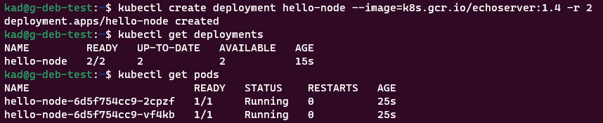
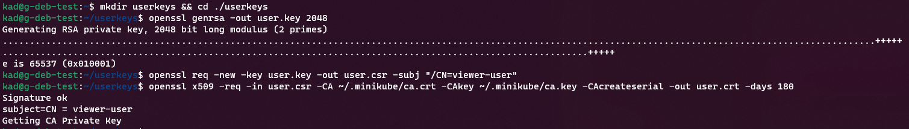
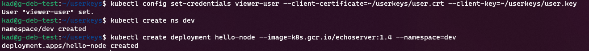
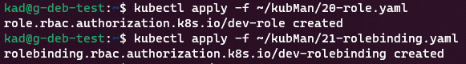

# 12.2 Команды для работы с Kubernetes — Алексей Храпов
Кластер — это сложная система, с которой крайне редко работает один человек. Квалифицированный devops умеет наладить работу всей команды, занимающейся каким-либо сервисом.
После знакомства с кластером вас попросили выдать доступ нескольким разработчикам. Помимо этого требуется служебный аккаунт для просмотра логов.

## Задание 1: Запуск пода из образа в деплойменте
Для начала следует разобраться с прямым запуском приложений из консоли. Такой подход поможет быстро развернуть инструменты отладки в кластере. Требуется запустить деплоймент на основе образа из hello world уже через deployment. Сразу стоит запустить 2 копии приложения (replicas=2). 

Требования:
 * пример из hello world запущен в качестве deployment
 * количество реплик в deployment установлено в 2
 * наличие deployment можно проверить командой kubectl get deployment
 * наличие подов можно проверить командой kubectl get pods

### **Ответ:**



---

## Задание 2: Просмотр логов для разработки
Разработчикам крайне важно получать обратную связь от штатно работающего приложения и, еще важнее, об ошибках в его работе. 
Требуется создать пользователя и выдать ему доступ на чтение конфигурации и логов подов в app-namespace.

Требования: 
 * создан новый токен доступа для пользователя
 * пользователь прописан в локальный конфиг (~/.kube/config, блок users)
 * пользователь может просматривать логи подов и их конфигурацию (kubectl logs pod <pod_id>, kubectl describe pod <pod_id>)

### **Ответ:**

Создание сертификата нового пользователя:



Создание пользователя, пространства имен и приложения для проверки:



Создание и привязка роли:



<details><summary>20-role.yaml</summary>

```yaml
apiVersion: rbac.authorization.k8s.io/v1
kind: Role
metadata:
  namespace: dev
  name: dev-role
rules:
- apiGroups: [""]
  resources: ["pods", "pods/log"]
  verbs: ["get", "list"]
```

</details>

<details><summary>21-rolebinding.yaml</summary>

```yaml
apiVersion: rbac.authorization.k8s.io/v1
kind: RoleBinding
metadata:
  name: dev-rolebinding
  namespace: dev
subjects:
- kind: User
  name: viewer-user
  apiGroup: rbac.authorization.k8s.io
roleRef:
  kind: Role
  name: dev-role
  apiGroup: rbac.authorization.k8s.io
```

</details>

Создание контекста и прееключение на него:

```bash
kad@g-deb-test:~$ kubectl config set-context dev --namespace=dev --cluster=minikube --user=viewer-user
Context "dev" created.
kad@g-deb-test:~$ kubectl config use-context dev
Switched to context "dev".
```

Проверка привелегий:

```bash
kad@g-deb-test:~$ kubectl get pods
NAME                          READY   STATUS    RESTARTS   AGE
hello-node-6d5f754cc9-2bz8s   1/1     Running   0          36m
kad@g-deb-test:~$ kubectl get pods -A
Error from server (Forbidden): pods is forbidden: User "viewer-user" cannot list resource "pods" in API group "" at the cluster scope
kad@g-deb-test:~$ kubectl logs pods/hello-node-6d5f754cc9-2bz8s
kad@g-deb-test:~$ kubectl delete pod hello-node-6d5f754cc9-2bz8s
Error from server (Forbidden): pods "hello-node-6d5f754cc9-2bz8s" is forbidden: User "viewer-user" cannot delete resource "pods" in API group "" in the namespace "dev"
```

---

## Задание 3: Изменение количества реплик 
Поработав с приложением, вы получили запрос на увеличение количества реплик приложения для нагрузки. Необходимо изменить запущенный deployment, увеличив количество реплик до 5. Посмотрите статус запущенных подов после увеличения реплик. 

Требования:
 * в deployment из задания 1 изменено количество реплик на 5
 * проверить что все поды перешли в статус running (kubectl get pods)

### **Ответ:**

```bash
kad@g-deb-test:~$ kubectl get pods
NAME                          READY   STATUS    RESTARTS   AGE
hello-node-6d5f754cc9-2cpzf   1/1     Running   0          58m
hello-node-6d5f754cc9-vf4kb   1/1     Running   0          58m
kad@g-deb-test:~$ kubectl scale deployment hello-node --replicas=5
deployment.apps/hello-node scaled
kad@g-deb-test:~$ kubectl get pods
NAME                          READY   STATUS    RESTARTS   AGE
hello-node-6d5f754cc9-2cpzf   1/1     Running   0          58m
hello-node-6d5f754cc9-d62q7   1/1     Running   0          4s
hello-node-6d5f754cc9-jnld5   1/1     Running   0          4s
hello-node-6d5f754cc9-jp4fn   1/1     Running   0          4s
hello-node-6d5f754cc9-vf4kb   1/1     Running   0          58m
```

---