# 09.04 Jenkins — Алексей Храпов

## Основная часть

1. Сделать Freestyle Job, который будет запускать `molecule test` из любого вашего репозитория с ролью.

Результат выполнения

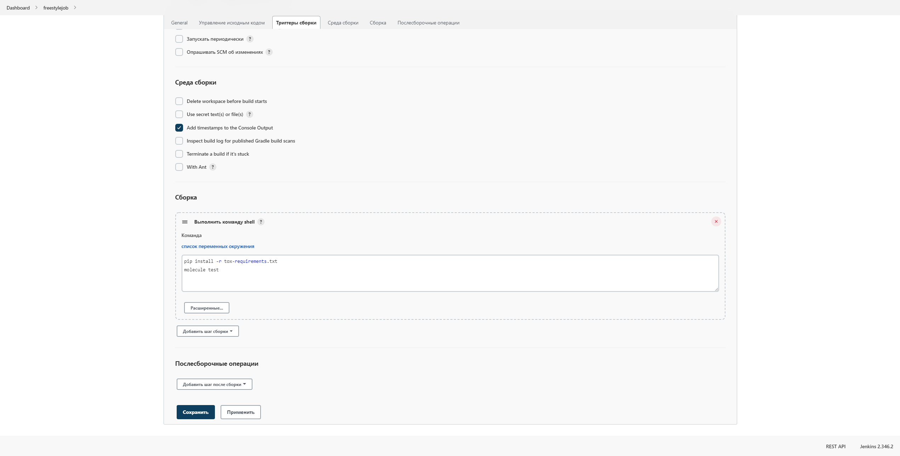
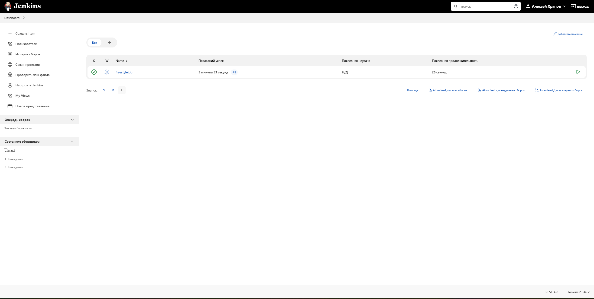

2. Сделать Declarative Pipeline Job, который будет запускать `molecule test` из любого вашего репозитория с ролью.

Результат выполнения

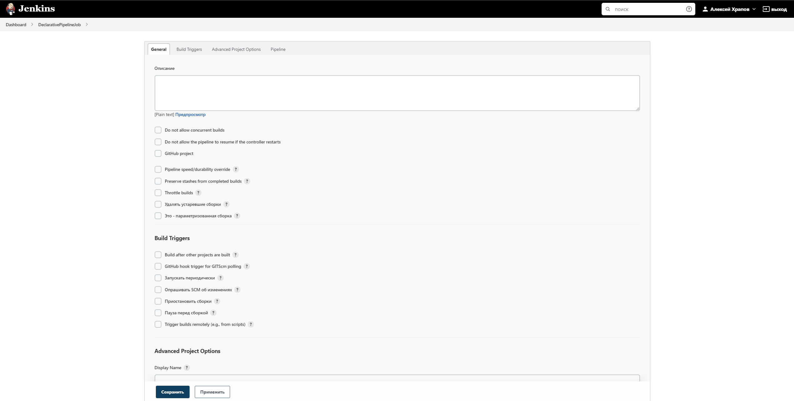
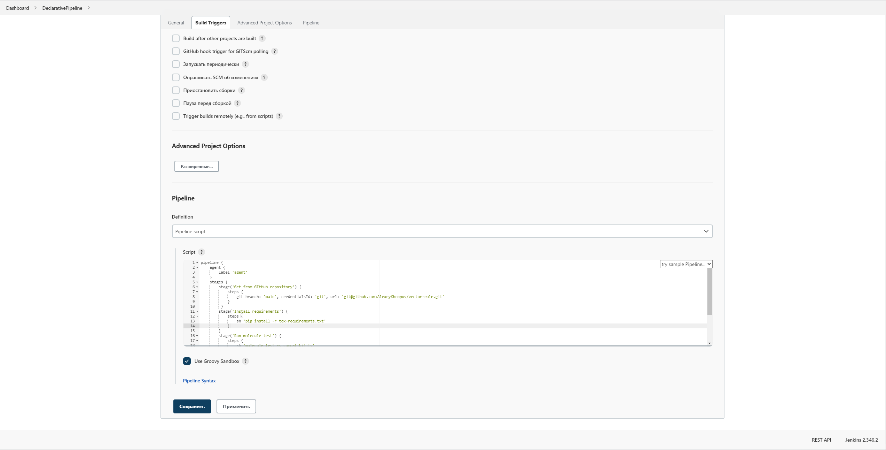
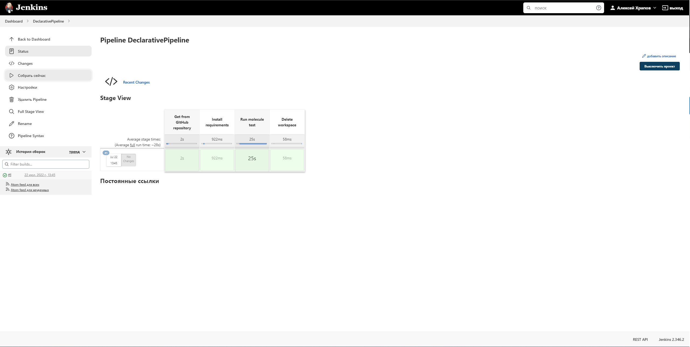

3. Перенести Declarative Pipeline в репозиторий в файл `Jenkinsfile`.

- [Jenkinsfile](https://github.com/AlexeyKhrapov/vector-role/blob/main/Jenkinsfile)

4. Создать Multibranch Pipeline на запуск `Jenkinsfile` из репозитория.

Результат выполнения

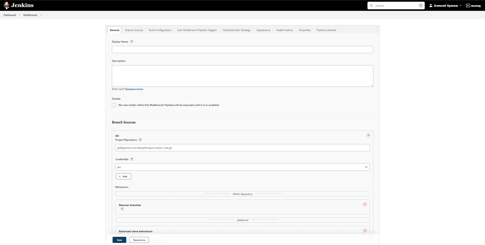
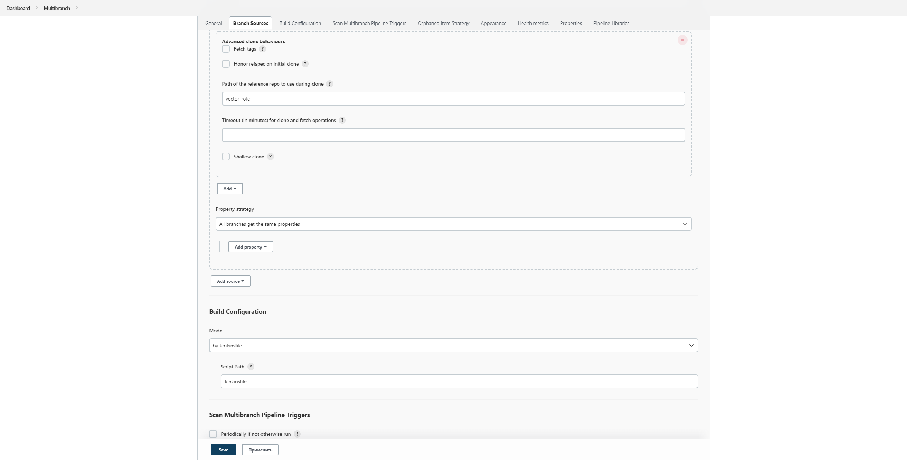
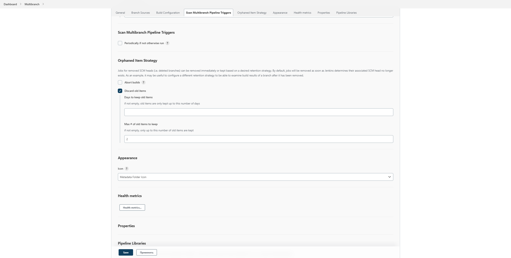
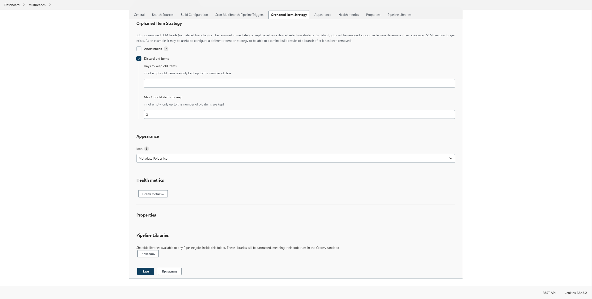
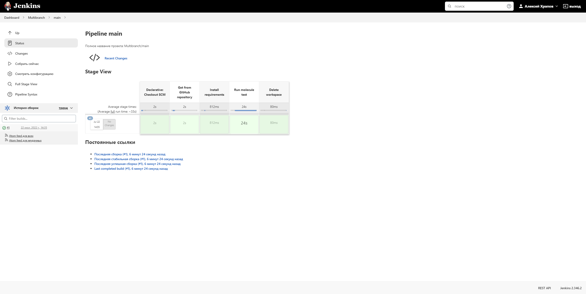

5. Создать Scripted Pipeline, наполнить его скриптом из [pipeline](./pipeline).
6. Внести необходимые изменения, чтобы Pipeline запускал `ansible-playbook` без флагов `--check --diff`, если не установлен параметр при запуске джобы (prod_run = True), по умолчанию параметр имеет значение False и запускает прогон с флагами `--check --diff`.
7. Проверить работоспособность, исправить ошибки, исправленный Pipeline вложить в репозиторий в файл `ScriptedJenkinsfile`.

Результат выполнения

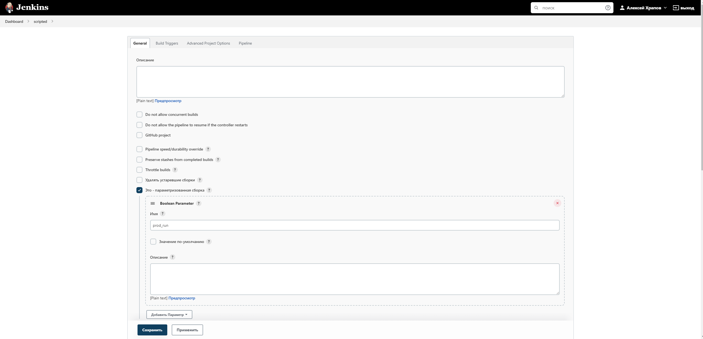
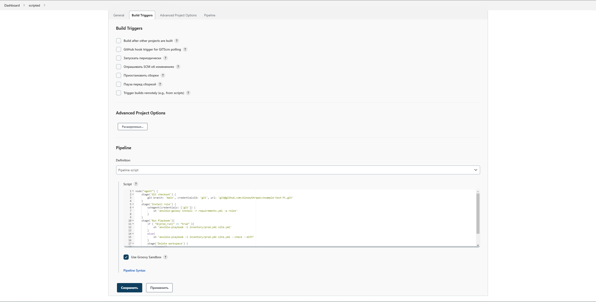
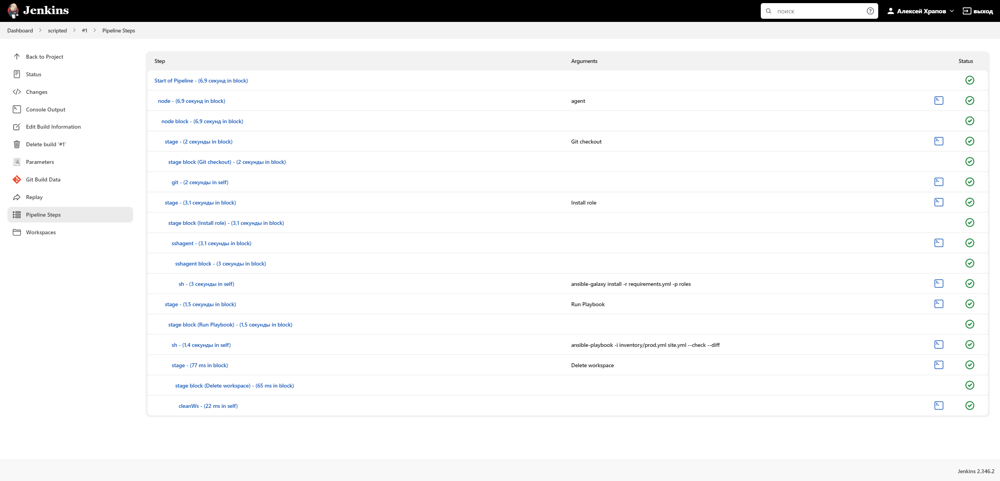

8. Отправить ссылку на репозиторий с ролью и Declarative Pipeline и Scripted Pipeline.

- [Jenkinsfile](https://github.com/AlexeyKhrapov/vector-role/blob/main/Jenkinsfile)
- [ScriptedJenkinsfile](./src/files/ScriptedJenkinsfile)
