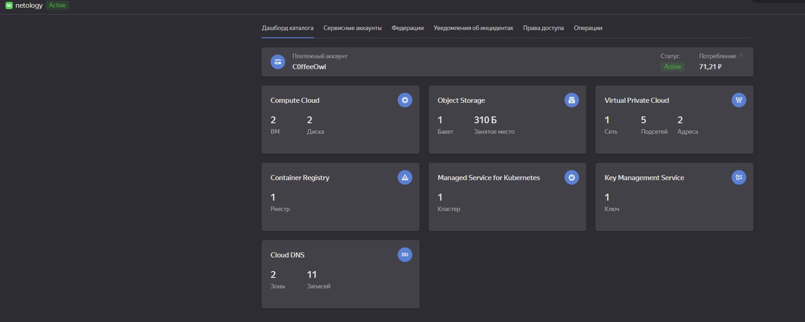
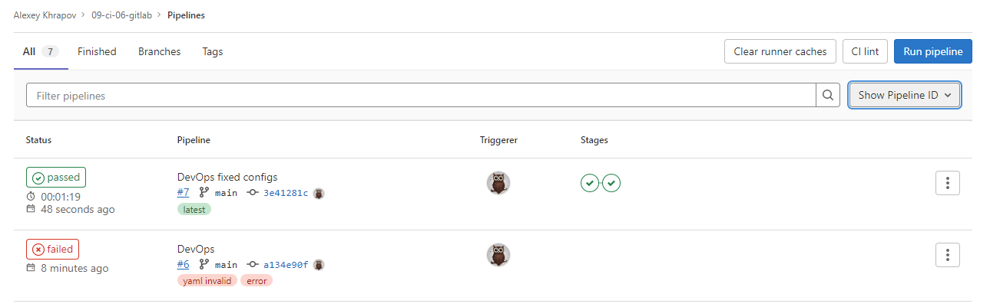
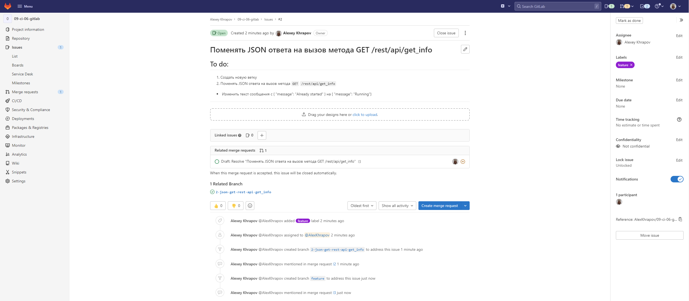
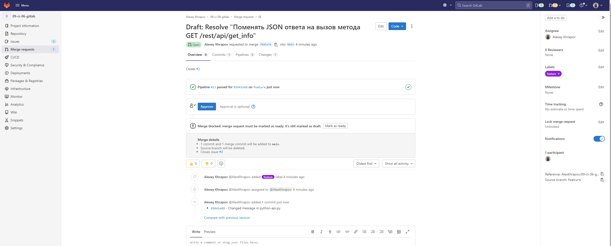
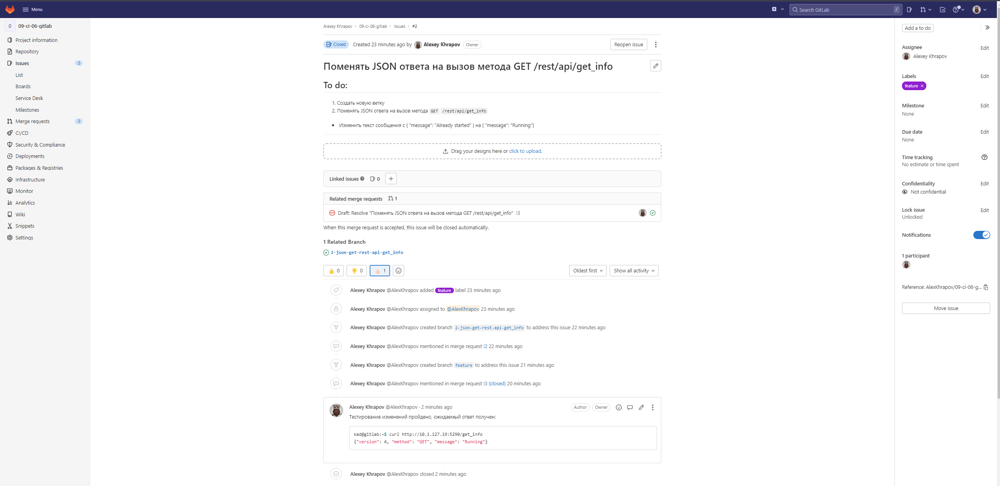

# 09.06 Gitlab — Алексей Храпов

## Основная часть

### DevOps

В репозитории содержится код проекта на python. Проект - RESTful API сервис. Ваша задача автоматизировать сборку образа с выполнением python-скрипта:
1. Образ собирается на основе [centos:7](https://hub.docker.com/_/centos?tab=tags&page=1&ordering=last_updated)
2. Python версии не ниже 3.7
3. Установлены зависимости: `flask` `flask-jsonpify` `flask-restful`
4. Создана директория `/python_api`
5. Скрипт из репозитория размещён в /python_api
6. Точка вызова: запуск скрипта
7. Если сборка происходит на ветке `master`: должен подняться pod kubernetes на основе образа `python-api`, иначе этот шаг нужно пропустить

### **Ответ:**

- [.gitlab-ci.yml](./src/files/task1/gitlab-ci.yml)
- [k8s.yaml](./src/files/task1/k8s.yaml)
- [Dockerfile](./src/files/task1/Dockerfile)

<details><summary>Консоль YandexCloud</summary>



</details>
<details><summary>Успешное выполнение pipeline</summary>



</details>

Проверка запуска pod'а (ветка в [настройках](./src/files/task1/gitlab-ci.yml) установлена `main`):

```bash
kad@lp-kad:~$ kubectl logs deployment/python-api-deployment -n python-api
 * Serving Flask app 'python-api' (lazy loading)
 * Environment: production
   WARNING: This is a development server. Do not use it in a production deployment.
   Use a production WSGI server instead.
 * Debug mode: off
 * Running on all addresses.
   WARNING: This is a development server. Do not use it in a production deployment.
 * Running on http://10.1.127.14:5290/ (Press CTRL+C to quit)
```


---

### Product Owner

Вашему проекту нужна бизнесовая доработка: необходимо поменять JSON ответа на вызов метода GET `/rest/api/get_info`, необходимо создать Issue в котором указать:
1. Какой метод необходимо исправить
2. Текст с `{ "message": "Already started" }` на `{ "message": "Running"}`
3. Issue поставить label: feature

### **Ответ:**

- [python-api.py](./src/files/task2/python-api.py)

<details><summary>Скриншот с Issue</summary>



</details>

---

### Developer

Вам пришел новый Issue на доработку, вам необходимо:
1. Создать отдельную ветку, связанную с этим issue
2. Внести изменения по тексту из задания
3. Подготовить Merge Requst, влить необходимые изменения в `master`, проверить, что сборка прошла успешно

### **Ответ:**

<details><summary>Merge Request с успешной сборкой</summary>



</details>

---

### Tester

Разработчики выполнили новый Issue, необходимо проверить валидность изменений:
1. Поднять докер-контейнер с образом `python-api:latest` и проверить возврат метода на корректность
2. Закрыть Issue с комментарием об успешности прохождения, указав желаемый результат и фактически достигнутый

### **Ответ:**

Проверка:
```bash
kad@lp-kad:~$ kubectl logs deployment/python-api-deployment -n python-api
 * Serving Flask app 'python-api' (lazy loading)
 * Environment: production
   WARNING: This is a development server. Do not use it in a production deployment.
   Use a production WSGI server instead.
 * Debug mode: off
 * Running on all addresses.
   WARNING: This is a development server. Do not use it in a production deployment.
 * Running on http://10.1.127.19:5290/ (Press CTRL+C to quit)

kad@lp-kad:~$ ssh 51.250.71.37
kad@gitlab:~$ curl http://10.1.127.19:5290/get_info
{"version": 4, "method": "GET", "message": "Running"}
```

<details><summary>Закрытая Issue</summary>



</details>

---

## Итог

После успешного прохождения всех ролей - отправьте ссылку на ваш проект в гитлаб, как решение домашнего задания

### **Ответ:**

Кластер Kubernetes остановлен. Проект на GitLab доступен по ссылке:

- http://51.250.71.37/AlexKhrapov/09-ci-06-gitlab


