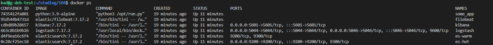
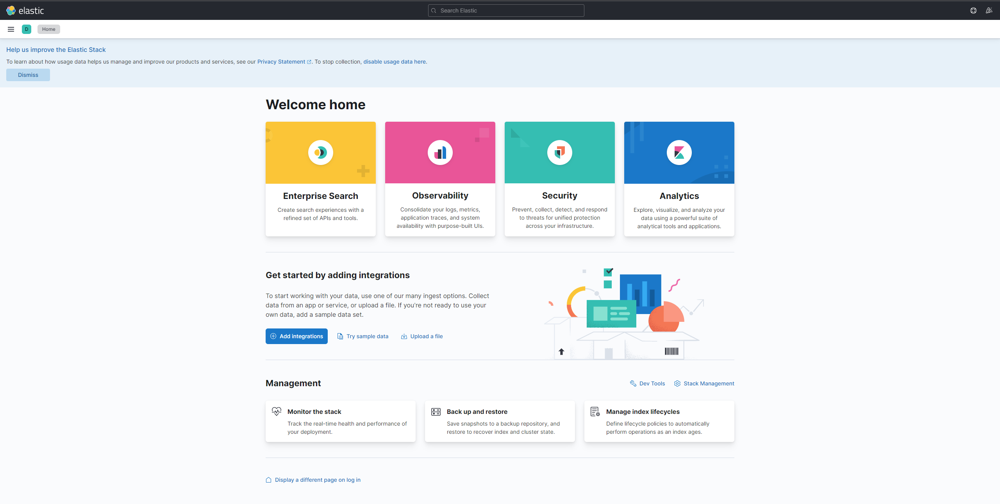
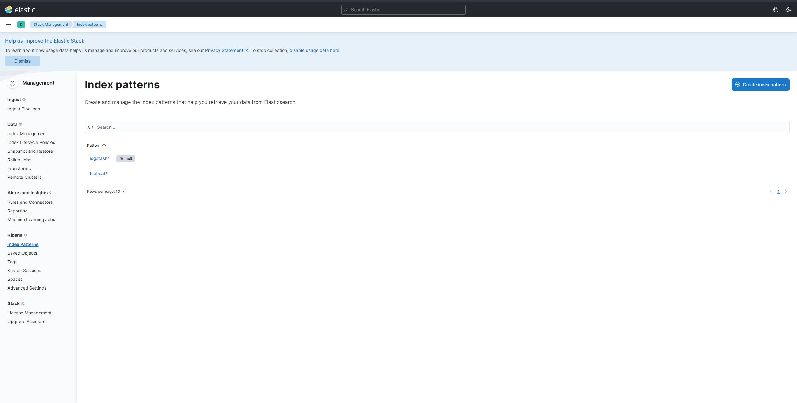
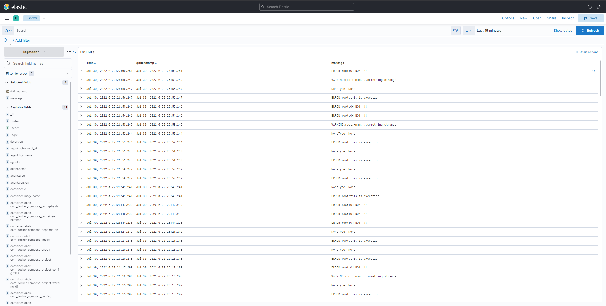

# Домашнее задание к занятию "10.04. ELK"

## Задание 1

Вам необходимо поднять в докере:
- elasticsearch(hot и warm ноды)
- logstash
- kibana
- filebeat

и связать их между собой.

Logstash следует сконфигурировать для приёма по tcp json сообщений.

Filebeat следует сконфигурировать для отправки логов docker вашей системы в logstash.

В директории [help](./help) находится манифест docker-compose и конфигурации filebeat/logstash для быстрого 
выполнения данного задания.

Результатом выполнения данного задания должны быть:
- скриншот `docker ps` через 5 минут после старта всех контейнеров (их должно быть 5)
- скриншот интерфейса kibana
- docker-compose манифест (если вы не использовали директорию help)
- ваши yml конфигурации для стека (если вы не использовали директорию help)

### **Ответ:**

Для выполнения задания изменил docker-compose манифест, чтобы не использовать VPN. Конфигурации файлов изменены незначительно. На повышенную сложность, как мне кажется, изменений слишком мало.
- [Манифест](./src/files/docker-compose.yml)
- [Kibana](./src/files/configs/kibana.yml)
- [Filebeat](./src/files/configs/filebeat.yml)
- [logstash](./src/files/configs/logstash/pipeline/logstash-simple.conf)

---

## Задание 2

Перейдите в меню [создания index-patterns  в kibana](http://localhost:5601/app/management/kibana/indexPatterns/create)
и создайте несколько index-patterns из имеющихся.

Перейдите в меню просмотра логов в kibana (Discover) и самостоятельно изучите как отображаются логи и как производить 
поиск по логам.

В манифесте директории help также приведенно dummy приложение, которое генерирует рандомные события в stdout контейнера.
Данные логи должны порождать индекс logstash-* в elasticsearch. Если данного индекса нет - воспользуйтесь советами 
и источниками из раздела "Дополнительные ссылки" данного ДЗ.
 
### **Ответ:**

Index Patterns:

Логи рандомных событий:

---