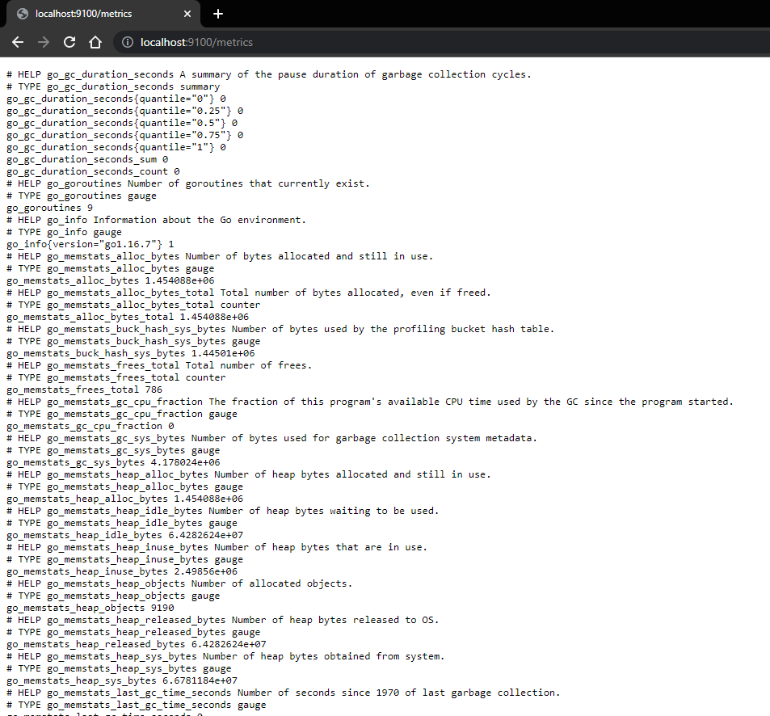
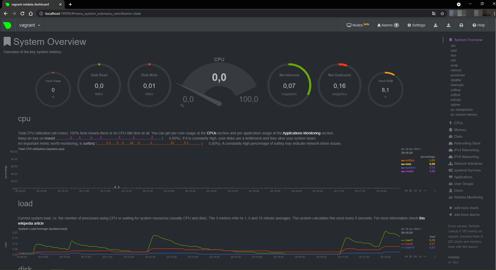

# 3.4. Операционные системы, лекция 2 — Алексей Храпов

> 1. На лекции мы познакомились с [node_exporter](https://github.com/prometheus/node_exporter/releases). В демонстрации его исполняемый файл запускался в background. Этого достаточно для демо, но не для настоящей production-системы, где процессы должны находиться под внешним управлением. Используя знания из лекции по systemd, создайте самостоятельно простой [unit-файл](https://www.freedesktop.org/software/systemd/man/systemd.service.html) для node_exporter:
>   * поместите его в автозагрузку,
>   * предусмотрите возможность добавления опций к запускаемому процессу через внешний файл (посмотрите, например, на `systemctl cat cron`),
>   * удостоверьтесь, что с помощью systemctl процесс корректно стартует, завершается, а после перезагрузки автоматически поднимается.

`node exporter` был установлен и помещен в автозагрузку. Автозагрузка работает.
Содержимое `unit-файла`:
```bash
vagrant@vagrant:~$ systemctl cat node_exporter
# /etc/systemd/system/node_exporter.service
[Unit]
Description=Node Exporter
After=network.target

[Service]
ExecStart=/usr/local/bin/node_exporter
EnvironmentFile=/etc/default/node_exporter

[Install]
WantedBy=multi-user.target
```
Проверка состояния после перезагрузки, остановка и запуск `node_exporter`:
```bash
vagrant@vagrant:~$ ps -e | grep node_exporter
    662 ?        00:00:00 node_exporter
vagrant@vagrant:~$ systemctl stop node_exporter
==== AUTHENTICATING FOR org.freedesktop.systemd1.manage-units ===
Authentication is required to stop 'node_exporter.service'.
Authenticating as: vagrant,,, (vagrant)
Password:
==== AUTHENTICATION COMPLETE ===
vagrant@vagrant:~$ ps -e | grep node_exporter
vagrant@vagrant:~$ systemctl start node_exporter
==== AUTHENTICATING FOR org.freedesktop.systemd1.manage-units ===
Authentication is required to start 'node_exporter.service'.
Authenticating as: vagrant,,, (vagrant)
Password:
==== AUTHENTICATION COMPLETE ===
vagrant@vagrant:~$ ps -e | grep node_exporter
   1343 ?        00:00:00 node_exporter
```
Проверка добавления опций:
```bash
root@vagrant:~# cat /etc/default/node_exporter
TestVariable="Hello, I'm here!"
root@vagrant:~# tr '\0' '\n' < /proc/1343/environ
LANG=en_US.UTF-8
LANGUAGE=en_US:
PATH=/usr/local/sbin:/usr/local/bin:/usr/sbin:/usr/bin:/sbin:/bin:/snap/bin
INVOCATION_ID=ff983afccca04fd58d3a4f411dd54e4f
JOURNAL_STREAM=9:26291
TestVariable=Hello, I'm here!
```
Отображение в браузере:


> 2. Ознакомьтесь с опциями node_exporter и выводом `/metrics` по-умолчанию. Приведите несколько опций, которые вы бы выбрали для базового мониторинга хоста по CPU, памяти, диску и сети.

CPU:
- `node_cpu_seconds_total`
- `process_cpu_seconds_total`

Память:
- `node_memory_MemAvailable_bytes`
- `node_memory_MemFree_bytes`

Диск:
- `node_disk_io_time_seconds_total`
- `node_disk_read_bytes_total`
- `node_disk_read_time_seconds_total`
- `node_disk_write_time_seconds_total`

Сеть:
- `node_network_receive_errs_total`
- `node_network_receive_bytes_total`
- `node_network_transmit_bytes_total`
- `node_network_transmit_errs_total`

> 3. Установите в свою виртуальную машину [Netdata](https://github.com/netdata/netdata). Воспользуйтесь [готовыми пакетами](https://packagecloud.io/netdata/netdata/install) для установки (`sudo apt install -y netdata`). После успешной установки:
>    * в конфигурационном файле `/etc/netdata/netdata.conf` в секции [web] замените значение с localhost на `bind to = 0.0.0.0`,
>    * добавьте в Vagrantfile проброс порта Netdata на свой локальный компьютер и сделайте `vagrant reload`:
>
>    ```bash
>    config.vm.network "forwarded_port", guest: 19999, host: 19999
>    ```
>
>    После успешной перезагрузки в браузере *на своем ПК* (не в виртуальной машине) вы должны суметь зайти на `localhost:19999`. Ознакомьтесь с метриками, которые по умолчанию собираются Netdata и с комментариями, которые даны к этим метрикам.



> 4. Можно ли по выводу `dmesg` понять, осознает ли ОС, что загружена не на настоящем оборудовании, а на системе виртуализации?

Можно:
```bash
vagrant@vagrant:~$ dmesg | grep virtualiz
[    0.001135] CPU MTRRs all blank - virtualized system.
[    0.057821] Booting paravirtualized kernel on KVM
[    3.708629] systemd[1]: Detected virtualization oracle.
```

> 5. Как настроен sysctl `fs.nr_open` на системе по-умолчанию? Узнайте, что означает этот параметр. Какой другой существующий лимит не позволит достичь такого числа (`ulimit --help`)?

```bash
vagrant@vagrant:~$ sysctl -n fs.nr_open
1048576
```
Это максимальное количество дескрипторов файлов, которое может выделить процесс. Значение по умолчанию - 1024 * 1024 (1048576)

Также можно посмотреть максимальный предел для ОС:
```bash
vagrant@vagrant:~$ cat /proc/sys/fs/file-max
9223372036854775807
```
Мягкий лимит на пользователя (может быть увеличен процессов в процессе работы):
```bash
vagrant@vagrant:~$ ulimit -Sn
1024
```
Жесткий лимит на пользователя (не может быть увеличен, только уменьшен):
```bash
vagrant@vagrant:~$ ulimit -Hn
1048576
```

> 6. Запустите любой долгоживущий процесс (не `ls`, который отработает мгновенно, а, например, `sleep 1h`) в отдельном неймспейсе процессов; покажите, что ваш процесс работает под PID 1 через `nsenter`. Для простоты работайте в данном задании под root (`sudo -i`). Под обычным пользователем требуются дополнительные опции (`--map-root-user`) и т.д.

```bash
root@vagrant:~# ps -e | grep sleep
   1556 pts/0    00:00:00 sleep
root@vagrant:~# nsenter --target 1556 --pid --mount
root@vagrant:/# ps
    PID TTY          TIME CMD
   1771 pts/1    00:00:00 sudo
   1772 pts/1    00:00:00 bash
   1785 pts/1    00:00:00 nsenter
   1786 pts/1    00:00:00 bash
   1797 pts/1    00:00:00 ps
```
> 7. Найдите информацию о том, что такое `:(){ :|:& };:`. Запустите эту команду в своей виртуальной машине Vagrant с Ubuntu 20.04 (**это важно, поведение в других ОС не проверялось**). Некоторое время все будет "плохо", после чего (минуты) – ОС должна стабилизироваться. Вызов `dmesg` расскажет, какой механизм помог автоматической стабилизации. Как настроен этот механизм по-умолчанию, и как изменить число процессов, которое можно создать в сессии?

`:(){ :|:& };:` определяет функцию с именем `:` , которая порождает саму себя (дважды, один канал переходит в другой) и создает фон.

Судя по выводу `dmesg`, ОС стабилизировалась благодаря этому функионалу:
```bash
[ 3781.743876] cgroup: fork rejected by pids controller in /user.slice/user-1000.slice/session-3.scope
```
Исходя из найденной информации, существует формула для расчета максимального количества активных PID или потоков.
Выдержка из [kernel/fork.c](https://github.com/torvalds/linux/blob/7c0f6ba682b9c7632072ffbedf8d328c8f3c42ba/kernel/fork.c#L402):
```bash
/*
 * set_max_threads
 */
static void set_max_threads(unsigned int max_threads_suggested)
{

    u64 threads;

    /*
     * The number of threads shall be limited such that the thread
     * structures may only consume a small part of the available memory.
     */
    if (fls64(totalram_pages) + fls64(PAGE_SIZE) > 64)
            threads = MAX_THREADS;
    else
            threads = div64_u64((u64) totalram_pages * (u64) PAGE_SIZE,
                                (u64) THREAD_SIZE * 8UL);

    if (threads > max_threads_suggested)
            threads = max_threads_suggested;

    max_threads = clamp_t(u64, threads, MIN_THREADS, MAX_THREADS);
}
```
В моём случае это количество `5103`:
```bash
vagrant@vagrant:~$ cat /sys/fs/cgroup/pids/user.slice/user-1000.slice/pids.max
5103
```
Изменить число процессов, которое можно создать в сессии (например, 99): `ulimit -u 99`.