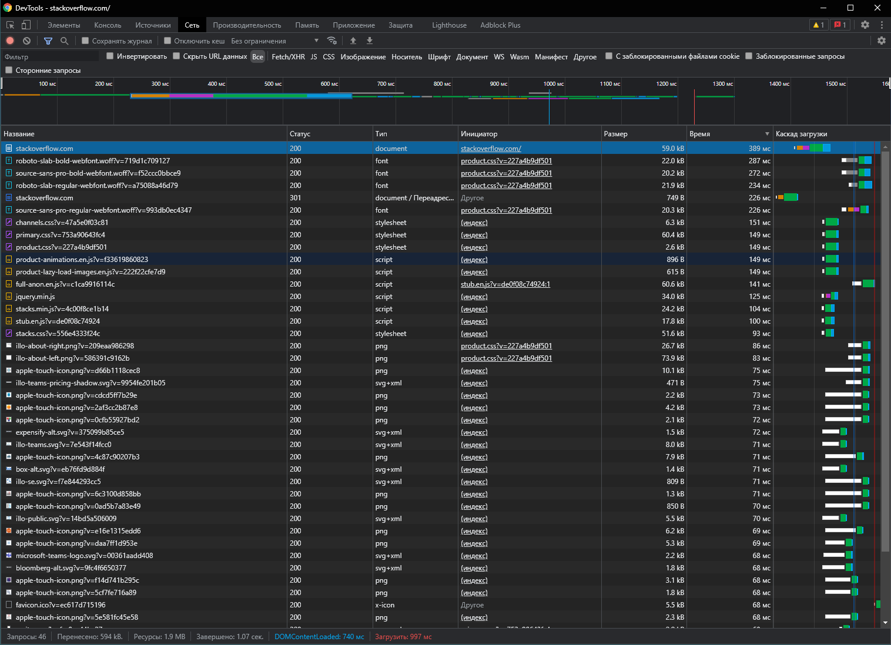

# 3.6. Компьютерные сети, лекция 1 — Алексей Храпов

> 1. Работа c HTTP через телнет.
>- Подключитесь утилитой телнет к сайту stackoverflow.com
> `telnet stackoverflow.com 80`
>- отправьте HTTP запрос
>```bash
>GET /questions HTTP/1.0
>HOST: stackoverflow.com
>[press enter]
>[press enter]
> ```
> - В ответе укажите полученный HTTP код, что он означает?

Полученный код:
```bash
HTTP/1.1 301 Moved Permanently
cache-control: no-cache, no-store, must-revalidate
location: https://stackoverflow.com/questions
x-request-guid: 13ecfbbb-a9eb-4044-b264-ec205c0b0077
feature-policy: microphone 'none'; speaker 'none'
content-security-policy: upgrade-insecure-requests; frame-ancestors 'self' https://stackexchange.com
Accept-Ranges: bytes
Date: Tue, 16 Nov 2021 14:30:09 GMT
Via: 1.1 varnish
Connection: close
X-Served-By: cache-fra19158-FRA
X-Cache: MISS
X-Cache-Hits: 0
X-Timer: S1637073010.782076,VS0,VE92
Vary: Fastly-SSL
X-DNS-Prefetch-Control: off
Set-Cookie: prov=71f26448-c40c-3e28-59e1-4d7b6a4ca20b; domain=.stackoverflow.com; expires=Fri, 01-Jan-2055 00:00:00 GMT; path=/; HttpOnly
```
 - `HTTP/1.1 301 Moved Permanently` - код перенаправления показывает, что запрошенный ресурс был окончательно перемещён в URL, указанный в заголовке `location`. Браузер в случае такого ответа перенаправляется на эту страницу.
 - `cache-control: no-cache, no-store, must-revalidate`: 
   - `cache-control` - используется для задания инструкций кеширования как для запросов, так и для ответов. 
   - `no-cache` - указывает на необходимость отправить запрос на сервер для валидации ресурса перед использованием закешированных данных. 
   - `must-revalidate` - кеш должен проверить статус устаревших ресурсов перед их использованием. Просроченные ресурсы не должны быть использованы.
 - `location: https://stackoverflow.com/questions` - URL, в который был перенаправлен ресурс `http://stackoverflow.com/questions`
 - `x-request-guid: 13ecfbbb-a9eb-4044-b264-ec205c0b0077` - идентификатор запроса (необязательный), указанный вызывающим абонентом, в форме GUID. Идентификатор `13ecfbbb-a9eb-4044-b264-ec205c0b0077` передан серверу, где он включен в журнал. Если клиент получает сообщение об ошибке, сервер может включить идентификатор в отчет об ошибке, позволяющий оператору искать соответствующие операторы журнала.
 - `feature-policy: microphone 'none'; speaker 'none'` - HTTP-заголовок, который сообщает, что микрофон и динамик отключены в контекстах просмотра верхнего уровня и вложенных.
 - `content-security-policy: upgrade-insecure-requests;` - HTTP-заголовок, обязывающий браузеры, которые поддерживают спецификацию `Upgrade-Insecure-Requests`, отправлять запросы на сайт в защищенном режиме.
 - `frame-ancestors` позволяет указывать множество доменов, которым разрешается встраивать эту страницу (в нашем случае это `https://stackexchange.com`). `'self'` обозначает тот же самый хост-источник, с которого был отправлен защищаемый в Content Security Policy документ.
 - `Accept-Ranges: bytes` - это маркер, который использует сервер, чтобы уведомить клиента о поддержке "запросов по кускам". Его значение указывает единицу измерения, которая может быть использована для определения диапазона чтения (в нашем случае байты).
 - `Date: Tue, 16 Nov 2021 14:30:09 GMT` - дата и время ответа на запрос.
 - `Via: 1.1 varnish` - Список версий протокола, названий и версий прокси-серверов, через которых прошло сообщение.
 - `Connection: close` - заголовок, указывающий, что клиент или сервер хотели бы закрыть соединение.
 - `X-Cache: MISS` - заголовок, сообщающий, что запрос обслуживается исходным сервером.
 - `X-Cache-Hits: 0` - заголовок, показывающий количество запросов, обработанных CDN.
 - `Vary: Fastly-SSL` - заголовок, определяющий, как сопоставить будущие заголовки запроса, чтобы решить, можно ли использовать кешированный ответ, а не запрашивать новый с исходного сервера.
 - `X-DNS-Prefetch-Control: off` - заголовок, отключающий предварительную настройку DNS.
 - `Set-Cookie: prov=71f26448-c40c-3e28-59e1-4d7b6a4ca20b; domain=.stackoverflow.com; expires=Fri, 01-Jan-2055 00:00:00 GMT; path=/; HttpOnly` - задан соответствующий cookie.


> 2. Повторите задание 1 в браузере, используя консоль разработчика F12.
> - откройте вкладку `Network`
> - отправьте запрос http://stackoverflow.com
> - найдите первый ответ HTTP сервера, откройте вкладку `Headers`
> - укажите в ответе полученный HTTP код.
> - проверьте время загрузки страницы, какой запрос обрабатывался дольше всего?
> - приложите скриншот консоли браузера в ответ.

Полученный код:
```bash
Accept-Ranges: bytes
cache-control: no-cache, no-store, must-revalidate
Connection: keep-alive
content-security-policy: upgrade-insecure-requests; frame-ancestors 'self' https://stackexchange.com
Date: Tue, 16 Nov 2021 15:38:47 GMT
feature-policy: microphone 'none'; speaker 'none'
location: https://stackoverflow.com/
Set-Cookie: prov=76ec7a73-cccf-2b76-6455-d176751b22fb; domain=.stackoverflow.com; expires=Fri, 01-Jan-2055 00:00:00 GMT; path=/; HttpOnly
Transfer-Encoding: chunked
Vary: Fastly-SSL
Via: 1.1 varnish
X-Cache: MISS
X-Cache-Hits: 0
X-DNS-Prefetch-Control: off
x-request-guid: 7d5f975f-753b-45b9-ac81-a19abbe79718
X-Served-By: cache-fra19126-FRA
X-Timer: S1637077128.784956,VS0,VE92
```
Дольше всего обрабатывался следующий запрос:
```bash
:authority: stackoverflow.com
:method: GET
:path: /
:scheme: https
accept: text/html,application/xhtml+xml,application/xml;q=0.9,image/avif,image/webp,image/apng,*/*;q=0.8,application/signed-exchange;v=b3;q=0.9
accept-encoding: gzip, deflate, br
accept-language: ru-RU,ru;q=0.9,en-US;q=0.8,en;q=0.7
cookie: prov=76ec7a73-cccf-2b76-6455-d176751b22fb
dnt: 1
sec-ch-ua: "Google Chrome";v="95", "Chromium";v="95", ";Not A Brand";v="99"
sec-ch-ua-mobile: ?0
sec-ch-ua-platform: "Windows"
sec-fetch-dest: document
sec-fetch-mode: navigate
sec-fetch-site: none
sec-fetch-user: ?1
upgrade-insecure-requests: 1
user-agent: Mozilla/5.0 (Windows NT 10.0; Win64; x64) AppleWebKit/537.36 (KHTML, like Gecko) Chrome/95.0.4638.69 Safari/537.36
```


> 3. Какой IP адрес у вас в интернете?

```bash
admin@LP-AHR:/mnt/c/Users/ahr$  wget -qO- ident.me
188.226.86.2
```

> 4. Какому провайдеру принадлежит ваш IP адрес? Какой автономной системе AS? Воспользуйтесь утилитой `whois`

```bash
admin@LP-AHR:/mnt/c/Users/ahr$ whois 188.226.86.2
% This is the RIPE Database query service.
% The objects are in RPSL format.
%
% The RIPE Database is subject to Terms and Conditions.
% See http://www.ripe.net/db/support/db-terms-conditions.pdf

% Note: this output has been filtered.
%       To receive output for a database update, use the "-B" flag.

% Information related to '188.226.0.0 - 188.226.127.255'

% Abuse contact for '188.226.0.0 - 188.226.127.255' is 'noc@itmh.ru'

inetnum:        188.226.0.0 - 188.226.127.255
netname:        RU-KTC-20090701
country:        RU
org:            ORG-EP3-RIPE
admin-c:        MRL42-RIPE
tech-c:         MRL42-RIPE
status:         ALLOCATED PA
mnt-by:         RIPE-NCC-HM-MNT
mnt-by:         EXTRIM-MNT
mnt-lower:      EXTRIM-MNT
mnt-routes:     EXTRIM-MNT
created:        2009-07-01T10:10:20Z
last-modified:  2016-05-20T12:26:04Z
source:         RIPE # Filtered

organisation:   ORG-EP3-RIPE
org-name:       LLC "KomTehCentr"
country:        RU
org-type:       LIR
address:        Bazhova 79, 211
address:        620075
address:        Yekaterinburg
address:        RUSSIAN FEDERATION
phone:          +73433790011
phone:          +73433790001
fax-no:         +73433790002
admin-c:        MRL42-RIPE
tech-c:         MRL42-RIPE
abuse-c:        MRL42-RIPE
mnt-ref:        RIPE-NCC-HM-MNT
mnt-ref:        EXTRIM-MNT
mnt-by:         RIPE-NCC-HM-MNT
mnt-by:         EXTRIM-MNT
created:        2004-04-17T11:52:32Z
last-modified:  2020-12-16T13:21:09Z
source:         RIPE # Filtered

role:           MIRALOGIC NOC role
address:        office 211, 46 Sulimova str., Yekaterinburg, Russia
admin-c:        ASD11-RIPE
admin-c:        JLJ26-RIPE
admin-c:        AV1359-RIPE
tech-c:         MNTR1-RIPE
tech-c:         VETR-RIPE
abuse-mailbox:  noc@itmh.ru
nic-hdl:        MRL42-RIPE
mnt-by:         EXTRIM-MNT
created:        2012-06-07T12:30:27Z
last-modified:  2020-09-08T14:23:03Z
source:         RIPE # Filtered

% Information related to '188.226.0.0/17AS12668'

route:          188.226.0.0/17
descr:          MiraLogic Telecommunication Systems
origin:         AS12668
mnt-by:         EXTRIM-MNT
created:        2009-07-01T11:25:17Z
last-modified:  2012-07-27T09:27:41Z
source:         RIPE

% This query was served by the RIPE Database Query Service version 1.101 (HEREFORD)
```
Провайдер: `MiraLogic Telecommunication Systems`

Автономная система: `AS12668`

> 5. Через какие сети проходит пакет, отправленный с вашего компьютера на адрес 8.8.8.8? Через какие AS? Воспользуйтесь утилитой `traceroute`

```bash
admin@LP-AHR:/mnt/c/Users/ahr$ traceroute -An 8.8.8.8
traceroute to 8.8.8.8 (8.8.8.8), 30 hops max, 60 byte packets
 1  172.23.96.1 [*]  0.857 ms  0.715 ms  0.703 ms
 2  172.16.103.1 [*]  2.112 ms  2.101 ms  2.092 ms
 3  188.226.15.209 [AS12668]  3.850 ms  3.840 ms  3.830 ms
 4  92.242.29.6 [AS12668]  3.799 ms  5.332 ms  5.322 ms
 5  212.188.22.34 [AS8359]  5.330 ms  7.823 ms  5.311 ms
 6  212.188.22.33 [AS8359]  5.304 ms  4.644 ms  4.592 ms
 7  212.188.29.249 [AS8359]  4.516 ms  4.477 ms  4.436 ms
 8  212.188.29.85 [AS8359]  20.870 ms  21.340 ms  21.291 ms
 9  195.34.50.161 [AS8359]  32.695 ms  32.659 ms  32.624 ms
10  212.188.29.82 [AS8359]  33.255 ms  32.558 ms  33.188 ms
11  * 108.170.250.83 [AS15169]  32.019 ms *
12  209.85.255.136 [AS15169]  47.090 ms 142.250.239.64 [AS15169]  45.617 ms *
13  216.239.57.222 [AS15169]  46.939 ms 108.170.235.64 [AS15169]  45.470 ms 172.253.65.82 [AS15169]  45.661 ms
14  142.250.210.103 [AS15169]  47.975 ms 142.250.56.127 [AS15169]  49.894 ms 172.253.51.247 [AS15169]  45.628 ms
15  * * *
16  * * *
17  * * *
18  * * *
19  * * *
20  * * *
21  * * *
22  * * *
23  * 8.8.8.8 [AS15169]  45.748 ms *
```

> 6. Повторите задание 5 в утилите `mtr`. На каком участке наибольшая задержка - delay?

```bash
admin@LP-AHR:/mnt/c/Users/ahr$ mtr -r -c 100 8.8.8.8 > mtr-report && cat mtr-report
Start: 2021-11-16T21:11:02+0500
HOST: LP-AHR                      Loss%   Snt   Last   Avg  Best  Wrst StDev
  1.|-- LP-AHR.sofp.local          0.0%   100    0.7   1.0   0.3   1.8   0.4
  2.|-- 172.16.103.1               0.0%   100    2.1   2.6   1.6   4.0   0.6
  3.|-- vl2786.ar132-35.ekb.ru.mi  0.0%   100   13.8   4.6   2.2  32.9   4.3
  4.|-- be2-4030.sr34-37.ekb.ru.m  0.0%   100    6.0   8.8   3.3  68.8   9.7
  5.|-- 212.188.22.34              0.0%   100    6.9   8.5   3.3  62.2  10.0
  6.|-- asb-cr01-ae9.200.ekt.mts-  0.0%   100    3.1   4.6   2.7  17.6   2.2
  7.|-- zoo-cr03-be1.66.ekt.mts-i  0.0%   100    3.5   4.4   2.9   5.6   0.6
  8.|-- vish-cr01-be7.66.kaz.mts-  1.0%   100   19.6  20.6  18.7  21.7   0.6
  9.|-- mag9-cr02-be6.16.msk.mts-  0.0%   100   31.3  32.4  31.3  33.8   0.6
 10.|-- mag9-cr01-be16.77.msk.mts  0.0%   100   31.5  32.3  31.1  33.6   0.6
 11.|-- 108.170.250.83            13.0%   100   30.4  32.4  30.3  46.4   2.7
 12.|-- 142.250.239.64            50.0%   100   43.8  45.4  43.3  69.6   4.0
 13.|-- 108.170.232.251            0.0%   100   42.9  45.3  42.4  84.9   5.8
 14.|-- 172.253.79.169             0.0%   100   42.4  43.0  41.7  44.2   0.5
 15.|-- ???                       100.0   100    0.0   0.0   0.0   0.0   0.0
 16.|-- ???                       100.0   100    0.0   0.0   0.0   0.0   0.0
 17.|-- ???                       100.0   100    0.0   0.0   0.0   0.0   0.0
 18.|-- ???                       100.0   100    0.0   0.0   0.0   0.0   0.0
 19.|-- ???                       100.0   100    0.0   0.0   0.0   0.0   0.0
 20.|-- ???                       100.0   100    0.0   0.0   0.0   0.0   0.0
 21.|-- ???                       100.0   100    0.0   0.0   0.0   0.0   0.0
 22.|-- ???                       100.0   100    0.0   0.0   0.0   0.0   0.0
 23.|-- ???                       100.0   100    0.0   0.0   0.0   0.0   0.0
 24.|-- dns.google                 0.0%   100   45.0  45.6  44.4  46.7   0.7
```

Наибольшая задержка была на участке `108.170.232.251`

Наибольшее средняя задержка была на участке `dns.google`

> 7. Какие DNS сервера отвечают за доменное имя dns.google? Какие A записи? воспользуйтесь утилитой `dig`

```bash
admin@LP-AHR:/mnt/c/Users/ahr$ dig +trace @8.8.8.8 dns.google

; <<>> DiG 9.11.5-P4-5.1+deb10u6-Debian <<>> +trace @8.8.8.8 dns.google
; (1 server found)
;; global options: +cmd
.                       19777   IN      NS      l.root-servers.net.
.                       19777   IN      NS      f.root-servers.net.
.                       19777   IN      NS      j.root-servers.net.
.                       19777   IN      NS      b.root-servers.net.
.                       19777   IN      NS      m.root-servers.net.
.                       19777   IN      NS      i.root-servers.net.
.                       19777   IN      NS      g.root-servers.net.
.                       19777   IN      NS      e.root-servers.net.
.                       19777   IN      NS      c.root-servers.net.
.                       19777   IN      NS      k.root-servers.net.
.                       19777   IN      NS      d.root-servers.net.
.                       19777   IN      NS      h.root-servers.net.
.                       19777   IN      NS      a.root-servers.net.
.                       19777   IN      RRSIG   NS 8 0 518400 20211128170000 20211115160000 14748 . cMDzdS/Dl2co0rAjHpbAB6m+REIoN6uEIht0me1w5CJmjLjmMu3W8gM3 p0mtMP9RgBuBJBCa+WfNCp/KvXGRkbHoYlVusclkpEs9dd+pC00PIYX7 5dLldo5utyuFvwiwPWi1s5OkWvn51taTlgGGVVdO2jjZYcUVxvbmnSiU V5n3jFxr23/u7pphRPA4eRrFkH6LOGhbepKX2qE4olrppLBP+Taspnpr WMEhUbP2I9HC185qLfqk/cq/DWfv04/QgioPiLSWIdSesAYDGEJO0sCr ScqRRd7Aq20rDfGVjBkcBQqPpILjTh2GhzQll8CBmTmHK/FUZyuf1kzs eyf9cA==
;; Received 525 bytes from 8.8.8.8#53(8.8.8.8) in 44 ms

google.                 172800  IN      NS      ns-tld2.charlestonroadregistry.com.
google.                 172800  IN      NS      ns-tld4.charlestonroadregistry.com.
google.                 172800  IN      NS      ns-tld3.charlestonroadregistry.com.
google.                 172800  IN      NS      ns-tld1.charlestonroadregistry.com.
google.                 172800  IN      NS      ns-tld5.charlestonroadregistry.com.
google.                 86400   IN      DS      6125 8 2 80F8B78D23107153578BAD3800E9543500474E5C30C29698B40A3DB2 3ED9DA9F
google.                 86400   IN      RRSIG   DS 8 1 86400 20211129050000 20211116040000 14748 . KJjVG5gMgIGqYG6fuscfypX50qoJZPU1T12RFNwFe7uHi4+tCfUmLAtd xST2V2OvcmDTEeFBqTl6a3TeFfOzJczV6sgZu7Na96oYcs6lNKLa6IwL EzBpB2rgSxxcPte6NJlc3J1GjvGf4Q51MJEAaKTlZIMfvvUQXjyHnPdy 9FAtMGBN6p1UynEu5g2aqtjyy3t0BcdtBEj0uOxebY3q7G4KpA3vgvY0 +vaDjknEPx6v00Rpn4Y/9tGtN+0dByP4Im+nZOpl6ooMeKk3FxUw95iw J4GacUktDX7qtcNYXvmxw4ra3ZgYArJTvYReQZ3t5Ilng4ycIrundqd/ jY/q/Q==
;; Received 758 bytes from 192.112.36.4#53(g.root-servers.net) in 140 ms

dns.google.             10800   IN      NS      ns3.zdns.google.
dns.google.             10800   IN      NS      ns1.zdns.google.
dns.google.             10800   IN      NS      ns2.zdns.google.
dns.google.             10800   IN      NS      ns4.zdns.google.
dns.google.             3600    IN      DS      56044 8 2 1B0A7E90AA6B1AC65AA5B573EFC44ABF6CB2559444251B997103D2E4 0C351B08
dns.google.             3600    IN      RRSIG   DS 8 2 3600 20211206042303 20211114042303 8830 google. GeLPRK+MKGF7VVXfaJcTebk1xAMKbAbbJny2ZmgmYX0EXp0TeuADlR/B YbzzGI1aAUwrCiofdvh2nA2NUTKKanGCjWrs7yMdJpHfDnjy2Qg3C+kP lRUPq0/DrDNHsantE6HX9YS5ESi/uKAJZkJmq+h4pmrLmM7jzJ6okTyL ZbY=
;; Received 506 bytes from 216.239.32.105#53(ns-tld1.charlestonroadregistry.com) in 72 ms

dns.google.             900     IN      A       8.8.8.8
dns.google.             900     IN      A       8.8.4.4
dns.google.             900     IN      RRSIG   A 8 2 900 20211216161145 20211116161145 1773 dns.google. NmjPsoQxvpnG0LCg6isHPUeR4pO/ja797bb09sR8/kjk8V6To+ZR/PyU k2tWxMzk8r6sQprbEpkESnFJKCxTg/57J3x/EzHNLfDI3L1+tkJjgy91 DrshFRJBIdG7DaJ2L6i6IhmSWqteQZ9stizSpMvLVAY6Fp97owqdZPtg h90=
;; Received 241 bytes from 216.239.34.114#53(ns2.zdns.google) in 72 ms
```
DNS-серверы:
- Корневые:
  - `l.root-servers.net`
  - `f.root-servers.net`
  - `j.root-servers.net`
  - `b.root-servers.net`
  - `m.root-servers.net`
  - `i.root-servers.net`
  - `g.root-servers.net`
  - `e.root-servers.net`
  - `c.root-servers.net`
  - `k.root-servers.net`
  - `d.root-servers.net`
  - `h.root-servers.net`
  - `a.root-servers.net`

- Зоны `.google`:
  - `ns-tld2.charlestonroadregistry.com`
  - `ns-tld4.charlestonroadregistry.com`
  - `ns-tld3.charlestonroadregistry.com`
  - `ns-tld1.charlestonroadregistry.com`
  - `ns-tld5.charlestonroadregistry.com`

- Зоны `dns.google`:
  - `ns3.zdns.google`
  - `ns1.zdns.google`
  - `ns2.zdns.google`
  - `ns4.zdns.google`

A-записи:
- `dns.google.             900     IN      A       8.8.8.8`
- `dns.google.             900     IN      A       8.8.4.4`

> 8. Проверьте PTR записи для IP адресов из задания 7. Какое доменное имя привязано к IP? воспользуйтесь утилитой `dig`
> В качестве ответов на вопросы можно приложить лог выполнения команд в консоли или скриншот полученных результатов.

```bash
admin@LP-AHR:/mnt/c/Users/ahr$ dig -x 8.8.8.8

; <<>> DiG 9.11.5-P4-5.1+deb10u6-Debian <<>> -x 8.8.8.8
;; global options: +cmd
;; Got answer:
;; ->>HEADER<<- opcode: QUERY, status: NOERROR, id: 56377
;; flags: qr rd ad; QUERY: 1, ANSWER: 1, AUTHORITY: 0, ADDITIONAL: 0
;; WARNING: recursion requested but not available

;; QUESTION SECTION:
;8.8.8.8.in-addr.arpa.          IN      PTR

;; ANSWER SECTION:
8.8.8.8.in-addr.arpa.   0       IN      PTR     dns.google.

;; Query time: 450 msec
;; SERVER: 172.23.96.1#53(172.23.96.1)
;; WHEN: Tue Nov 16 21:32:27 +05 2021
;; MSG SIZE  rcvd: 82

admin@LP-AHR:/mnt/c/Users/ahr$ dig -x 8.8.4.4

; <<>> DiG 9.11.5-P4-5.1+deb10u6-Debian <<>> -x 8.8.4.4
;; global options: +cmd
;; Got answer:
;; ->>HEADER<<- opcode: QUERY, status: NOERROR, id: 53478
;; flags: qr rd ad; QUERY: 1, ANSWER: 1, AUTHORITY: 0, ADDITIONAL: 0
;; WARNING: recursion requested but not available

;; QUESTION SECTION:
;4.4.8.8.in-addr.arpa.          IN      PTR

;; ANSWER SECTION:
4.4.8.8.in-addr.arpa.   0       IN      PTR     dns.google.

;; Query time: 292 msec
;; SERVER: 172.23.96.1#53(172.23.96.1)
;; WHEN: Tue Nov 16 21:32:38 +05 2021
;; MSG SIZE  rcvd: 82
```