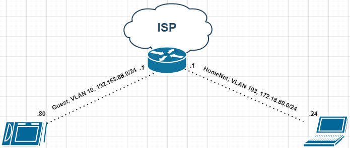

# 3.8. Компьютерные сети, лекция 3 — Алексей Храпов

>1. Подключитесь к публичному маршрутизатору в интернет. Найдите маршрут к вашему публичному IP
>```
>telnet route-views.routeviews.org
>Username: rviews
>show ip route x.x.x.x/32
>show bgp x.x.x.x/32
>```
Ожидаемого результата добиться не удалось:
```bash
vagrant@vagrant:~$ telnet route-views.routeviews.org
Trying 128.223.51.103...
Connected to route-views.routeviews.org.
Escape character is '^]'.
C
**********************************************************************

                    RouteViews BGP Route Viewer
                    route-views.routeviews.org

 route views data is archived on http://archive.routeviews.org

 This hardware is part of a grant by the NSF.
 Please contact help@routeviews.org if you have questions, or
 if you wish to contribute your view.

 This router has views of full routing tables from several ASes.
 The list of peers is located at http://www.routeviews.org/peers
 in route-views.oregon-ix.net.txt

 NOTE: The hardware was upgraded in August 2014.  If you are seeing
 the error message, "no default Kerberos realm", you may want to
 in Mac OS X add "default unset autologin" to your ~/.telnetrc

 To login, use the username "rviews".

 **********************************************************************


User Access Verification

Username: rviews
route-views>show ip route 188.226.86.2/32
                                      ^
% Invalid input detected at '^' marker.

route-views>show ip route 188.226.86.2
Routing entry for 188.226.0.0/17
  Known via "bgp 6447", distance 20, metric 0
  Tag 6939, type external
  Last update from 64.71.137.241 7w0d ago
  Routing Descriptor Blocks:
  * 64.71.137.241, from 64.71.137.241, 7w0d ago
      Route metric is 0, traffic share count is 1
      AS Hops 2
      Route tag 6939
      MPLS label: none
route-views>show bgp 188.226.86.2/32
% Network not in table
route-views>show bgp 188.226.86.2
BGP routing table entry for 188.226.0.0/17, version 1085792791
Paths: (24 available, best #22, table default)
  Not advertised to any peer
  Refresh Epoch 3
  3303 12389 12668
    217.192.89.50 from 217.192.89.50 (138.187.128.158)
      Origin IGP, localpref 100, valid, external
      Community: 3303:1004 3303:1006 3303:1030 3303:3056 12668:0
      path 7FE141EC5110 RPKI State not found
      rx pathid: 0, tx pathid: 0
  Refresh Epoch 1
  7660 2516 12389 12668
    203.181.248.168 from 203.181.248.168 (203.181.248.168)
      Origin IGP, localpref 100, valid, external
      Community: 2516:1050 7660:9003
      path 7FE0F4278708 RPKI State not found
      rx pathid: 0, tx pathid: 0
  Refresh Epoch 1
  3267 12668
    194.85.40.15 from 194.85.40.15 (185.141.126.1)
      Origin IGP, metric 0, localpref 100, valid, external
      path 7FE159B80090 RPKI State not found
      rx pathid: 0, tx pathid: 0
  Refresh Epoch 1
  57866 3356 12389 12668
    37.139.139.17 from 37.139.139.17 (37.139.139.17)
      Origin IGP, metric 0, localpref 100, valid, external
      Community: 3356:2 3356:22 3356:100 3356:123 3356:507 3356:903 3356:2111 12668:0
      path 7FE0BD50EDE0 RPKI State not found
      rx pathid: 0, tx pathid: 0
  Refresh Epoch 1
  7018 3356 12389 12668
    12.0.1.63 from 12.0.1.63 (12.0.1.63)
      Origin IGP, localpref 100, valid, external
      Community: 7018:5000 7018:37232
      path 7FE0D11C16E0 RPKI State not found
      rx pathid: 0, tx pathid: 0
  Refresh Epoch 1
  3333 8359 12668
    193.0.0.56 from 193.0.0.56 (193.0.0.56)
      Origin IGP, localpref 100, valid, external
      Community: 8359:609 8359:2020 8359:2100 8359:2130 8359:2220 8359:2250 8359:2260 8359:2270 8359:2320 8359:2340 8359:2352 8359:2372 8359:2380 8359:2502 8359:2510 8359:2520 8359:2540 8359:2630 8359:2650 8359:5500 8359:55566 12668:0
      path 7FE0F5A9EDD8 RPKI State not found
      rx pathid: 0, tx pathid: 0
  Refresh Epoch 1
  49788 12552 12389 12668
    91.218.184.60 from 91.218.184.60 (91.218.184.60)
      Origin IGP, localpref 100, valid, external
      Community: 12552:12000 12552:12100 12552:12101 12552:22000
      Extended Community: 0x43:100:1
      path 7FE15621A4D8 RPKI State not found
      rx pathid: 0, tx pathid: 0
  Refresh Epoch 1
  20912 3257 12389 12389 12389 12389 12668
    212.66.96.126 from 212.66.96.126 (212.66.96.126)
      Origin IGP, localpref 100, valid, external
      Community: 3257:4000 3257:8794 3257:50001 3257:50110 3257:54900 3257:54901 20912:65004
      path 7FE0355ACCD8 RPKI State not found
      rx pathid: 0, tx pathid: 0
  Refresh Epoch 1
  8283 8359 12668
    94.142.247.3 from 94.142.247.3 (94.142.247.3)
      Origin IGP, metric 0, localpref 100, valid, external
      Community: 8283:1 8283:101 8359:609 8359:2020 8359:2100 8359:2130 8359:2220 8359:2250 8359:2260 8359:2270 8359:2320 8359:2340 8359:2352 8359:2372 8359:2380 8359:2502 8359:2510 8359:2520 8359:2540 8359:2630 8359:2650 8359:5500 8359:55566 12668:0
      unknown transitive attribute: flag 0xE0 type 0x20 length 0x18
        value 0000 205B 0000 0000 0000 0001 0000 205B
              0000 0005 0000 0001
      path 7FE15AC9F1A0 RPKI State not found
      rx pathid: 0, tx pathid: 0
  Refresh Epoch 1
  3356 12389 12668
    4.68.4.46 from 4.68.4.46 (4.69.184.201)
      Origin IGP, metric 0, localpref 100, valid, external
      Community: 3356:2 3356:22 3356:100 3356:123 3356:507 3356:903 3356:2111 12668:0
      path 7FE17C03F030 RPKI State not found
      rx pathid: 0, tx pathid: 0
  Refresh Epoch 1
  1221 4637 12389 12668
    203.62.252.83 from 203.62.252.83 (203.62.252.83)
      Origin IGP, localpref 100, valid, external
      path 7FE0981AF098 RPKI State not found
      rx pathid: 0, tx pathid: 0
  Refresh Epoch 1
  2497 12389 12668
    202.232.0.2 from 202.232.0.2 (58.138.96.254)
      Origin IGP, localpref 100, valid, external
      path 7FE135FBF608 RPKI State not found
      rx pathid: 0, tx pathid: 0
  Refresh Epoch 1
  852 3356 12389 12668
    154.11.12.212 from 154.11.12.212 (96.1.209.43)
      Origin IGP, metric 0, localpref 100, valid, external
      path 7FE1286B2468 RPKI State not found
      rx pathid: 0, tx pathid: 0
  Refresh Epoch 1
  20130 6939 12668
    140.192.8.16 from 140.192.8.16 (140.192.8.16)
      Origin IGP, localpref 100, valid, external
      path 7FE0B6A5AFF0 RPKI State not found
      rx pathid: 0, tx pathid: 0
  Refresh Epoch 1
  701 1273 12389 12389 12389 12389 12389 12389 12668
    137.39.3.55 from 137.39.3.55 (137.39.3.55)
      Origin IGP, localpref 100, valid, external
      path 7FE0E8B4DBD0 RPKI State not found
      rx pathid: 0, tx pathid: 0
  Refresh Epoch 1
  3257 12389 12389 12389 12389 12668
    89.149.178.10 from 89.149.178.10 (213.200.83.26)
      Origin IGP, metric 10, localpref 100, valid, external
      Community: 3257:4000 3257:8794 3257:50001 3257:50110 3257:54900 3257:54901
      path 7FE0C6CCB488 RPKI State not found
      rx pathid: 0, tx pathid: 0
  Refresh Epoch 1
  3549 3356 12389 12668
    208.51.134.254 from 208.51.134.254 (67.16.168.191)
      Origin IGP, metric 0, localpref 100, valid, external
      Community: 3356:2 3356:22 3356:100 3356:123 3356:507 3356:903 3356:2111 3549:2581 3549:30840 12668:0
      path 7FE0FD2B0EF0 RPKI State not found
      rx pathid: 0, tx pathid: 0
  Refresh Epoch 1
  19214 174 3356 12389 12668
    208.74.64.40 from 208.74.64.40 (208.74.64.40)
      Origin IGP, localpref 100, valid, external
      Community: 174:21000 174:22013
      path 7FE1796CBC18 RPKI State not found
      rx pathid: 0, tx pathid: 0
  Refresh Epoch 1
  53767 14315 6453 6453 3356 12389 12668
    162.251.163.2 from 162.251.163.2 (162.251.162.3)
      Origin IGP, localpref 100, valid, external
      Community: 14315:5000 53767:5000
      path 7FE0C0DC0770 RPKI State not found
      rx pathid: 0, tx pathid: 0
  Refresh Epoch 1
  101 3356 12389 12668
    209.124.176.223 from 209.124.176.223 (209.124.176.223)
      Origin IGP, localpref 100, valid, external
      Community: 101:20100 101:20110 101:22100 3356:2 3356:22 3356:100 3356:123 3356:507 3356:903 3356:2111 12668:0
      Extended Community: RT:101:22100
      path 7FE13B728568 RPKI State not found
      rx pathid: 0, tx pathid: 0
  Refresh Epoch 1
  3561 3910 3356 12389 12668
    206.24.210.80 from 206.24.210.80 (206.24.210.80)
      Origin IGP, localpref 100, valid, external
      path 7FE16F177308 RPKI State not found
      rx pathid: 0, tx pathid: 0
  Refresh Epoch 1
  6939 12668
    64.71.137.241 from 64.71.137.241 (216.218.252.164)
      Origin IGP, localpref 100, valid, external, best
      unknown transitive attribute: flag 0xE0 type 0x20 length 0xC
        value 0000 21B7 0000 0777 0000 A8CD
      path 7FE1128CAD90 RPKI State not found
      rx pathid: 0, tx pathid: 0x0
  Refresh Epoch 1
  4901 6079 8359 12668
    162.250.137.254 from 162.250.137.254 (162.250.137.254)
      Origin IGP, localpref 100, valid, external
      Community: 65000:10100 65000:10300 65000:10400
      path 7FE051276910 RPKI State not found
      rx pathid: 0, tx pathid: 0
  Refresh Epoch 1
  1351 8359 12668
    132.198.255.253 from 132.198.255.253 (132.198.255.253)
      Origin IGP, localpref 100, valid, external
      path 7FE04B453230 RPKI State not found
      rx pathid: 0, tx pathid: 0
```
При просмотре выводов `show ip route` выяснилось:
```bash
      188.226.0.0/17 is subnetted, 2 subnets
B        188.226.0.0 [20/0] via 64.71.137.241, 7w0d
B        188.226.128.0 [20/0] via 94.142.247.3, 3d00h
```
>2. Создайте dummy0 интерфейс в Ubuntu. Добавьте несколько статических маршрутов. Проверьте таблицу маршрутизации.
```bash
vagrant@vagrant:~$ sudo modprobe dummy
vagrant@vagrant:~$ ip link
1: lo: <LOOPBACK,UP,LOWER_UP> mtu 65536 qdisc noqueue state UNKNOWN mode DEFAULT group default qlen 1000
    link/loopback 00:00:00:00:00:00 brd 00:00:00:00:00:00
2: eth0: <BROADCAST,MULTICAST,UP,LOWER_UP> mtu 1500 qdisc fq_codel state UP mode DEFAULT group default qlen 1000
    link/ether 08:00:27:73:60:cf brd ff:ff:ff:ff:ff:ff
3: eth0.3@eth0: <BROADCAST,MULTICAST,UP,LOWER_UP> mtu 1500 qdisc noqueue state UP mode DEFAULT group default qlen 1000
    link/ether 08:00:27:73:60:cf brd ff:ff:ff:ff:ff:ff
vagrant@vagrant:~$ sudo ip link add eth1 type dummy
vagrant@vagrant:~$ ip link show eth1
4: eth1: <BROADCAST,NOARP> mtu 1500 qdisc noop state DOWN mode DEFAULT group default qlen 1000
    link/ether da:fd:be:22:5d:f4 brd ff:ff:ff:ff:ff:ff
vagrant@vagrant:~$ sudo ip addr add 192.168.1.100/24 brd + dev eth1 label eth1:0
vagrant@vagrant:~$ sudo ip link set dev eth1 up
vagrant@vagrant:~$ sudo ip route
default via 10.0.2.2 dev eth0 proto dhcp src 10.0.2.15 metric 100
10.0.2.0/24 dev eth0 proto kernel scope link src 10.0.2.15
10.0.2.2 dev eth0 proto dhcp scope link src 10.0.2.15 metric 100
10.0.3.0/24 dev eth0.3 proto kernel scope link src 10.0.3.200
vagrant@vagrant:~$ sudo ip route add 192.168.100.0/24 via 10.0.2.15 dev eth0
vagrant@vagrant:~$ sudo ip route del 0.0.0.0/0 via 192.168.1.100 dev eth1
vagrant@vagrant:~$ ip route
default via 10.0.2.2 dev eth0 proto dhcp src 10.0.2.15 metric 100
default via 192.168.1.100 dev eth1 metric 200
10.0.2.0/24 dev eth0 proto kernel scope link src 10.0.2.15
10.0.2.2 dev eth0 proto dhcp scope link src 10.0.2.15 metric 100
10.0.3.0/24 dev eth0.3 proto kernel scope link src 10.0.3.200
192.168.1.0/24 dev eth1 proto kernel scope link src 192.168.1.100
192.168.100.0/24 via 10.0.2.15 dev eth0
```
>3. Проверьте открытые TCP порты в Ubuntu, какие протоколы и приложения используют эти порты? Приведите несколько примеров.
```bash
vagrant@vagrant:~$ sudo netstat -tlpn
Active Internet connections (only servers)
Proto Recv-Q Send-Q Local Address           Foreign Address         State       PID/Program name
tcp        0      0 127.0.0.1:8125          0.0.0.0:*               LISTEN      1079/netdata
tcp        0      0 0.0.0.0:19999           0.0.0.0:*               LISTEN      1079/netdata
tcp        0      0 0.0.0.0:111             0.0.0.0:*               LISTEN      1/init
tcp        0      0 127.0.0.53:53           0.0.0.0:*               LISTEN      785/systemd-resolve
tcp        0      0 0.0.0.0:22              0.0.0.0:*               LISTEN      1101/sshd: /usr/sbi
tcp6       0      0 ::1:8125                :::*                    LISTEN      1079/netdata
tcp6       0      0 :::12865                :::*                    LISTEN      1108/netserver
tcp6       0      0 :::9100                 :::*                    LISTEN      876/node_exporter
tcp6       0      0 :::111                  :::*                    LISTEN      1/init
tcp6       0      0 :::22                   :::*                    LISTEN      1101/sshd: /usr/sbi
```
Т.к. проверялись порты TCP, то видно использование только протокола TCP для IPv4 и IPv6.
Используемы порты и приложения, которые их используют:
 - 8125, 19999, - netdata
 - 12865 - netserver
 - 9100 - node exporter
 - 22 - ssh
 - 111 - RPC 4.0 portmapper
 - 53 - DNS, используется системой
>4. Проверьте используемые UDP сокеты в Ubuntu, какие протоколы и приложения используют эти порты?
```bash
vagrant@vagrant:~$ sudo netstat -ulpn
Active Internet connections (only servers)
Proto Recv-Q Send-Q Local Address           Foreign Address         State       PID/Program name
udp        0      0 127.0.0.1:8125          0.0.0.0:*                           1079/netdata
udp        0      0 127.0.0.53:53           0.0.0.0:*                           785/systemd-resolve
udp        0      0 10.0.2.15:68            0.0.0.0:*                           474/systemd-network
udp        0      0 0.0.0.0:111             0.0.0.0:*                           1/init
udp6       0      0 ::1:8125                :::*                                1079/netdata
udp6       0      0 :::111                  :::*                                1/init
```
Т.к. проверялись порты UDP, то видно использование только протокола UDP для IPv4 и IPv6.
Используемы порты и приложения, которые их используют:
 - 8125 - netdata
 - 111 - RPC 4.0 portmapper
 - 53 - DNS, используется системой
 - 68 - bootpc, используется системой

>5. Используя diagrams.net, создайте L3 диаграмму вашей домашней сети или любой другой сети, с которой вы работали. 


