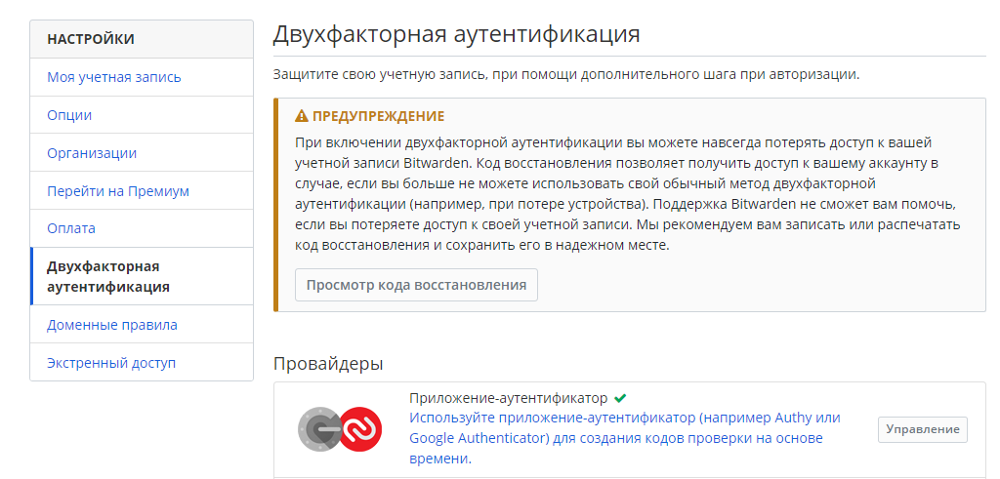
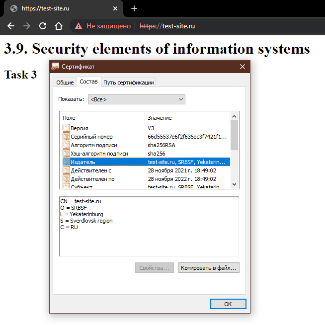
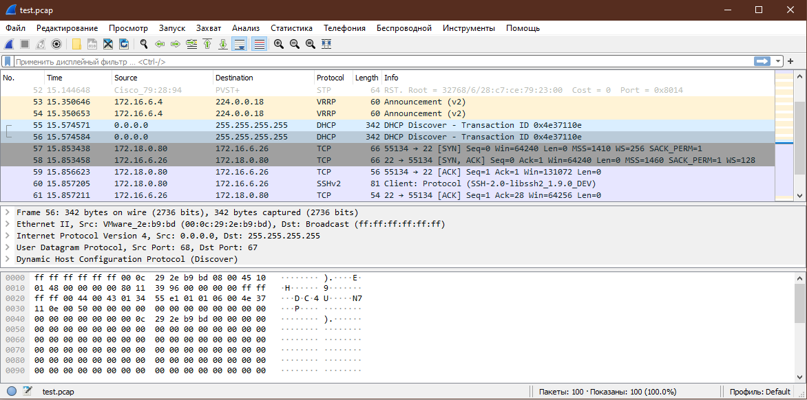

# 3.9. Элементы безопасности информационных систем — Алексей Храпов

>1. Установите Bitwarden плагин для браузера. Зарегестрируйтесь и сохраните несколько паролей.


>2. Установите Google authenticator на мобильный телефон. Настройте вход в Bitwarden акаунт через Google authenticator OTP.



>3. Установите apache2, сгенерируйте самоподписанный сертификат, настройте тестовый сайт для работы по HTTPS.

```bash
vagrant@vagrant:~$ sudo apt install apache2
Enabling module access_compat.
Enabling module authn_file.
Enabling module authz_user.
Enabling module alias.
Enabling module dir.
Enabling module autoindex.
Enabling module env.
Enabling module mime.
Enabling module negotiation.
Enabling module setenvif.
Enabling module filter.
Enabling module deflate.
Enabling module status.
Enabling module reqtimeout.
Enabling conf charset.
Enabling conf localized-error-pages.
Enabling conf other-vhosts-access-log.
Enabling conf security.
Enabling conf serve-cgi-bin.
Enabling site 000-default.
Created symlink /etc/systemd/system/multi-user.target.wants/apache2.service → /lib/systemd/system/apache2.service.
Created symlink /etc/systemd/system/multi-user.target.wants/apache-htcacheclean.service → /lib/systemd/system/apache-htcacheclean.service.
Processing triggers for ufw (0.36-6) ...
Processing triggers for systemd (245.4-4ubuntu3.13) ...
Processing triggers for man-db (2.9.1-1) ...
Processing triggers for libc-bin (2.31-0ubuntu9.2) ...
vagrant@vagrant:~$ sudo a2enmod ssl
Considering dependency setenvif for ssl:
Module setenvif already enabled
Considering dependency mime for ssl:
Module mime already enabled
Considering dependency socache_shmcb for ssl:
Enabling module socache_shmcb.
Enabling module ssl.
See /usr/share/doc/apache2/README.Debian.gz on how to configure SSL and create self-signed certificates.
To activate the new configuration, you need to run:
  systemctl restart apache2
vagrant@vagrant:~$ sudo systemctl restart apache2
vagrant@vagrant:~$ sudo openssl req -x509 -nodes -days 365 -newkey rsa:2048 -keyout /etc/ssl/private/example.key -out /etc/ssl/certs/example.crt -subj "/C=RU/ST=Sverdlovsk region/L=Yekaterinburg/O=SRBSF/CN=test-site.ru"
Generating a RSA private key
..........+++++
......+++++
writing new private key to '/etc/ssl/private/example.key'
-----
vagrant@vagrant:~$ sudo nano /etc/apache2/sites-available/test-site_ru.conf


vagrant@vagrant:~$ sudo mkdir /var/www/test-site_ru
vagrant@vagrant:~$ sudo nano /var/www/test-site_ru/index.html
vagrant@vagrant:~$ sudo a2ensite test-site_ru.conf
Enabling site test-site_ru.
To activate the new configuration, you need to run:
  systemctl reload apache2
vagrant@vagrant:~$ sudo apache2ctl configtest
Syntax OK
vagrant@vagrant:~$ sudo systemctl reload apache2
```

>4. Проверьте на TLS уязвимости произвольный сайт в интернете.

```bash
vagrant@vagrant:~/testssl.sh$ ./testssl.sh -U --sneaky https://gitlab.sofp.ru

###########################################################
    testssl.sh       3.1dev from https://testssl.sh/dev/
    (f253920 2021-11-23 09:59:41 -- )

      This program is free software. Distribution and
             modification under GPLv2 permitted.
      USAGE w/o ANY WARRANTY. USE IT AT YOUR OWN RISK!

       Please file bugs @ https://testssl.sh/bugs/

###########################################################

 Using "OpenSSL 1.0.2-chacha (1.0.2k-dev)" [~183 ciphers]
 on vagrant:./bin/openssl.Linux.x86_64
 (built: "Jan 18 17:12:17 2019", platform: "linux-x86_64")


 Start 2021-11-28 14:13:01        -->> 212.49.125.204:443 (gitlab.sofp.ru) <<--

 rDNS (212.49.125.204):      gitlab.sofp.ru. faq.sofp.ru.
 Service detected:       HTTP


 Testing vulnerabilities

 Heartbleed (CVE-2014-0160)                not vulnerable (OK), no heartbeat extension
 CCS (CVE-2014-0224)                       not vulnerable (OK)
 Ticketbleed (CVE-2016-9244), experiment.  not vulnerable (OK)
 ROBOT                                     Server does not support any cipher suites that use RSA key transport
 Secure Renegotiation (RFC 5746)           supported (OK)
 Secure Client-Initiated Renegotiation     not vulnerable (OK)
 CRIME, TLS (CVE-2012-4929)                not vulnerable (OK)
 BREACH (CVE-2013-3587)                    no gzip/deflate/compress/br HTTP compression (OK)  - only supplied "/" tested
 POODLE, SSL (CVE-2014-3566)               not vulnerable (OK)
 TLS_FALLBACK_SCSV (RFC 7507)              No fallback possible (OK), no protocol below TLS 1.2 offered
 SWEET32 (CVE-2016-2183, CVE-2016-6329)    not vulnerable (OK)
 FREAK (CVE-2015-0204)                     not vulnerable (OK)
 DROWN (CVE-2016-0800, CVE-2016-0703)      not vulnerable on this host and port (OK)
                                           make sure you don't use this certificate elsewhere with SSLv2 enabled services
                                           https://censys.io/ipv4?q=B58914E3401685F7C710D591AFCBF0919BAE38E665ECA991D7AE31FA536B298D could help you to find out
 LOGJAM (CVE-2015-4000), experimental      not vulnerable (OK): no DH EXPORT ciphers, no common prime detected
 BEAST (CVE-2011-3389)                     not vulnerable (OK), no SSL3 or TLS1
 LUCKY13 (CVE-2013-0169), experimental     not vulnerable (OK)
 Winshock (CVE-2014-6321), experimental    not vulnerable (OK)
 RC4 (CVE-2013-2566, CVE-2015-2808)        no RC4 ciphers detected (OK)


 Done 2021-11-28 14:13:13 [  13s] -->> 212.49.125.204:443 (gitlab.sofp.ru) <<--
```
>5. Установите на Ubuntu ssh сервер, сгенерируйте новый приватный ключ. Скопируйте свой публичный ключ на другой сервер. Подключитесь к серверу по SSH-ключу.

```bash
vagrant@vagrant:~$ sudo apt install openssh-server
Reading package lists... Done
Building dependency tree
Reading state information... Done
openssh-server is already the newest version (1:8.2p1-4ubuntu0.3).
0 upgraded, 0 newly installed, 0 to remove and 44 not upgraded.
vagrant@vagrant:~$ ssh-keygen
Generating public/private rsa key pair.
Enter file in which to save the key (/home/vagrant/.ssh/id_rsa):
Enter passphrase (empty for no passphrase):
Enter same passphrase again:
Your identification has been saved in /home/vagrant/.ssh/id_rsa
Your public key has been saved in /home/vagrant/.ssh/id_rsa.pub
The key fingerprint is:
SHA256:QmWKXJ2OURDGXEcyHOMAWzeIFhNr74o22lLCGP3ZWqo vagrant@vagrant
The key's randomart image is:
+---[RSA 3072]----+
|    =BBO%+o      |
|   .oO=B+*       |
| . .* o+.        |
|. .. o. .        |
|o. . oo S        |
|o.. o.o.         |
| o   +.          |
|..o.o.           |
|.+Eo.            |
+----[SHA256]-----+
vagrant@vagrant:~$ ssh-copy-id test@172.16.103.21
/usr/bin/ssh-copy-id: INFO: Source of key(s) to be installed: "/home/vagrant/.ssh/id_rsa.pub"
The authenticity of host '172.16.103.21 (172.16.103.21)' can't be established.
ECDSA key fingerprint is SHA256:+4NSyGJsZc3amadjMaqRnqQDG0/LAiwzqJM+CER50WI.
Are you sure you want to continue connecting (yes/no/[fingerprint])? yes
/usr/bin/ssh-copy-id: INFO: attempting to log in with the new key(s), to filter out any that are already installed
/usr/bin/ssh-copy-id: INFO: 1 key(s) remain to be installed -- if you are prompted now it is to install the new keys
test@172.16.103.21's password:

Number of key(s) added: 1

Now try logging into the machine, with:   "ssh 'test@172.16.103.21'"
and check to make sure that only the key(s) you wanted were added.

vagrant@vagrant:~$ ssh test@172.16.103.21
Enter passphrase for key '/home/vagrant/.ssh/id_rsa':
Linux deb-test 5.10.0-8-amd64 #1 SMP Debian 5.10.46-4 (2021-08-03) x86_64

The programs included with the Debian GNU/Linux system are free software;
the exact distribution terms for each program are described in the
individual files in /usr/share/doc/*/copyright.

Debian GNU/Linux comes with ABSOLUTELY NO WARRANTY, to the extent
permitted by applicable law.
test@deb-test:~$
``` 
>6. Переименуйте файлы ключей из задания 5. Настройте файл конфигурации SSH клиента, так чтобы вход на удаленный сервер осуществлялся по имени сервера.

```bash
vagrant@vagrant:~$ mv ./.ssh/id_rsa rsa && mv ./.ssh/id_rsa.pub rsa.pub
vagrant@vagrant:~$ nano ./.ssh/config
vagrant@vagrant:~$ ssh deb-test
Enter passphrase for key '/home/vagrant/.ssh/rsa':
Linux deb-test 5.10.0-8-amd64 #1 SMP Debian 5.10.46-4 (2021-08-03) x86_64

The programs included with the Debian GNU/Linux system are free software;
the exact distribution terms for each program are described in the
individual files in /usr/share/doc/*/copyright.

Debian GNU/Linux comes with ABSOLUTELY NO WARRANTY, to the extent
permitted by applicable law.
Last login: Sun Nov 28 19:39:15 2021 from 172.16.103.144
test@deb-test:~$
```
>7. Соберите дамп трафика утилитой tcpdump в формате pcap, 100 пакетов. Откройте файл pcap в Wireshark.

```bash
it-admin@web:~$ sudo tcpdump -w test.pcap -i eth0 -c 100
[sudo] password for odmin: 
tcpdump: listening on eth0, link-type EN10MB (Ethernet), capture size 262144 bytes
100 packets captured
111 packets received by filter
0 packets dropped by kernel
```

 ---
## Задания для самостоятельной отработки (необязательно к выполнению)

>8*. Просканируйте хост scanme.nmap.org. Какие сервисы запущены?

```bash
vagrant@vagrant:~$ nmap -v scanme.nmap.org
Starting Nmap 7.80 ( https://nmap.org ) at 2021-11-28 15:22 UTC
Initiating Ping Scan at 15:22
Scanning scanme.nmap.org (45.33.32.156) [2 ports]
Completed Ping Scan at 15:22, 0.21s elapsed (1 total hosts)
Initiating Parallel DNS resolution of 1 host. at 15:22
Completed Parallel DNS resolution of 1 host. at 15:22, 0.00s elapsed
Initiating Connect Scan at 15:22
Scanning scanme.nmap.org (45.33.32.156) [1000 ports]
Discovered open port 80/tcp on 45.33.32.156
Discovered open port 22/tcp on 45.33.32.156
Discovered open port 31337/tcp on 45.33.32.156
Discovered open port 9929/tcp on 45.33.32.156
Completed Connect Scan at 15:22, 12.85s elapsed (1000 total ports)
Nmap scan report for scanme.nmap.org (45.33.32.156)
Host is up (0.21s latency).
Other addresses for scanme.nmap.org (not scanned): 2600:3c01::f03c:91ff:fe18:bb2f
Not shown: 996 filtered ports
PORT      STATE SERVICE
22/tcp    open  ssh
80/tcp    open  http
9929/tcp  open  nping-echo
31337/tcp open  Elite

Read data files from: /usr/bin/../share/nmap
Nmap done: 1 IP address (1 host up) scanned in 13.08 seconds
```
>9*. Установите и настройте фаервол ufw на web-сервер из задания 3. Откройте доступ снаружи только к портам 22,80,443

```bash
vagrant@vagrant:~$ sudo apt install ufw
Reading package lists... Done
Building dependency tree
Reading state information... Done
The following packages will be upgraded:
  ufw
1 upgraded, 0 newly installed, 0 to remove and 43 not upgraded.
Need to get 147 kB of archives.
After this operation, 3,072 B of additional disk space will be used.
Get:1 http://archive.ubuntu.com/ubuntu focal-updates/main amd64 ufw all 0.36-6ubuntu1 [147 kB]
Fetched 147 kB in 1s (149 kB/s)
Preconfiguring packages ...
(Reading database ... 94905 files and directories currently installed.)
Preparing to unpack .../ufw_0.36-6ubuntu1_all.deb ...
Unpacking ufw (0.36-6ubuntu1) over (0.36-6) ...
Setting up ufw (0.36-6ubuntu1) ...
Processing triggers for man-db (2.9.1-1) ...
Processing triggers for rsyslog (8.2001.0-1ubuntu1.1) ...
Processing triggers for systemd (245.4-4ubuntu3.13) ...
vagrant@vagrant:~$ sudo ufw allow allow ssh/tcp
ERROR: Need 'to' or 'from' clause
vagrant@vagrant:~$ sudo ufw allow ssh/tcp
Rules updated
Rules updated (v6)
vagrant@vagrant:~$ sudo ufw allow http
Rules updated
Rules updated (v6)
vagrant@vagrant:~$ sudo ufw allow https
Rules updated
Rules updated (v6)
vagrant@vagrant:~$ sudo ufw enable
Command may disrupt existing ssh connections. Proceed with operation (y|n)? y
Firewall is active and enabled on system startup
vagrant@vagrant:~$ sudo ufw status verbose
Status: active
Logging: on (low)
Default: deny (incoming), allow (outgoing), disabled (routed)
New profiles: skip

To                         Action      From
--                         ------      ----
22/tcp                     ALLOW IN    Anywhere
80/tcp                     ALLOW IN    Anywhere
443/tcp                    ALLOW IN    Anywhere
22/tcp (v6)                ALLOW IN    Anywhere (v6)
80/tcp (v6)                ALLOW IN    Anywhere (v6)
443/tcp (v6)               ALLOW IN    Anywhere (v6)
```
