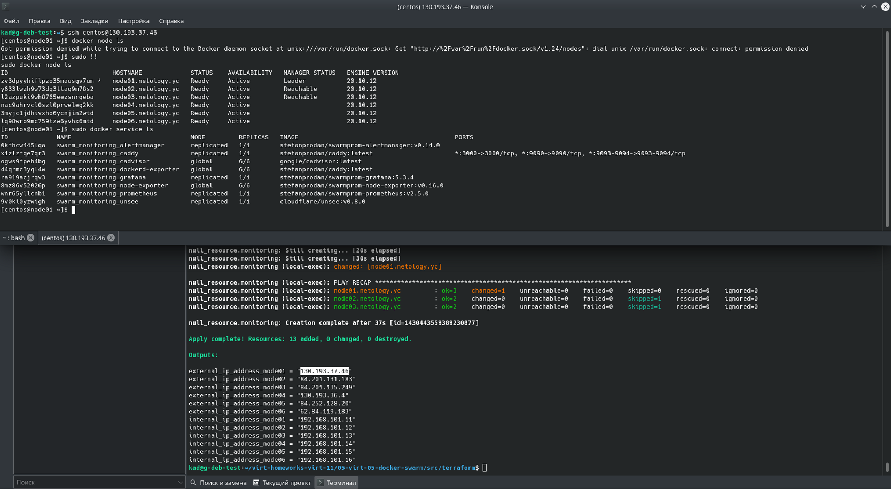

# 5.5. Оркестрация кластером Docker контейнеров на примере Docker Swarm — Алексей Храпов

## Задача 1

Дайте письменые ответы на следующие вопросы:

- В чём отличие режимов работы сервисов в Docker Swarm кластере: replication и global?
- Какой алгоритм выбора лидера используется в Docker Swarm кластере?
- Что такое Overlay Network?

### Ответ:
> - В чём отличие режимов работы сервисов в Docker Swarm кластере: replication и global?

Для `replication` указывается, сколько идентичных задач нужно запустить в общем, а для `global`
запускатся одна задача на каждой ноде (предварительно заданного количества задач нет).
> - Какой алгоритм выбора лидера используется в Docker Swarm кластере?

Используется алгоритм `Raft`. 
Если обычный узел долго не получает сообщений от лидера, то он переходит в состояние «кандидат» и
посылает другим узлам запрос на голосование. Другие узлы голосуют за того кандидата, от которого 
они получили первый запрос. Если кандидат получает сообщение от лидера, то он снимает свою 
кандидатуру и возвращается в обычное состояние. Если кандидат получает большинство голосов, то он
становится лидером. Если же он не получил большинства (это случай, когда на кластере возникли 
сразу несколько кандидатов и голоса разделились), то кандидат ждёт случайное время и 
инициирует новую процедуру голосования.

Процедура голосования повторяется, пока не будет выбран лидер.
> - Что такое Overlay Network?

Overlay-сети используются в контексте кластеров Docker Swarm, где виртуальная сеть, 
которую используют контейнеры, связывает несколько физических хостов, на которых запущен Docker.

---

## Задача 2

Создать ваш первый Docker Swarm кластер в Яндекс.Облаке

Для получения зачета, вам необходимо предоставить скриншот из терминала (консоли), с выводом команды:
```
docker node ls
```
### Ответ:



---
## Задача 3

Создать ваш первый, готовый к боевой эксплуатации кластер мониторинга, состоящий из стека микросервисов.

Для получения зачета, вам необходимо предоставить скриншот из терминала (консоли), с выводом команды:
```
docker service ls
```

### Ответ:


---
## Задача 4 (*)

Выполнить на лидере Docker Swarm кластера команду (указанную ниже) и дать письменное описание её функционала, что она делает и зачем она нужна:
```
# см.документацию: https://docs.docker.com/engine/swarm/swarm_manager_locking/
docker swarm update --autolock=true
```

### Ответ:
Команда `docker swarm update --autolock=true` включает автоблокировку существующего кластера 
Docker Swarm. 

Автоблокировка позволяет защитить общий ключ шифрования TLS и ключ, используемый для 
шифрования и расшифровки журналов Raft в состоянии покоя, позволяя стать владельцем 
этих ключей и требовать ручной разблокировки ваших менеджеров.

Когда Docker перезапустится, необходимо будет сначала разблокировать кластер, используя ключ 
шифрования, сгенерированный при инициализации автоблокировки.

Ключ шифрования можно обновить командой `docker swarm unlock-key --rotate`, также можно
просмотреть текущий ключ, выполнив команду `docker swarm unlock-key`.

Вывод команды:
```bash
[centos@node01 ~]$ sudo docker swarm update --autolock=true
Swarm updated.
To unlock a swarm manager after it restarts, run the `docker swarm unlock`
command and provide the following key:

    SWMKEY-1-DWGrzBtCHbECbdsohI7FHfxJx3K3KSA7PHVg6vVlun4

Please remember to store this key in a password manager, since without it you
will not be able to restart the manager.
```